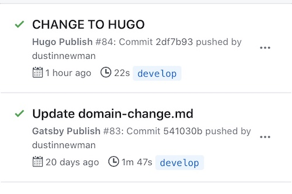

It took around a minute and a half for this site to build with GatsbyJS and what came out after was a near horrifying mess of “bundle split” JavaScript files and all sorts of underscores. Overall, it totalled up to over 88 kB! And that was just for my index page with a couple paragraphs and a nav bar. *Spoiler alert* but after switching to Hugo, I can build in less than 30 seconds with a sane output format consisting of just TWO kB (for the home page). ✌️ At the end, I have basically the exact equivalent of what I would have hand coded, for a fraction of the time and effort. This is, traditionally perhaps, what a static site generator is **supposed** to feel like. 

I initially got into Gatsby when I didn’t know much else about the web other than what I had seen from the JavaScript world. That is, HTML as the medium, but JavaScript as the messenger. Taken to the extremes of React, sometimes the HTML is a mere husk with a single dummy div named “content” that hoists the real content on screen. Maybe I’ve just gotten old 👨‍🦳, but I can’t believe I thought that was the best way to do this! 

Now I can safely say I’ve seen the light: the lightness of a true static site! GatsbyJS is a behemoth, pulling in content to load into a JSON dependency graph populated with data queried through GraphQL semantics on the client side. If that sounds confusing, it’s because it is. Now, it may have its use cases in frontend-centric circles, where proficiency with React and friends is a gold star, but for my simple blog, it was way over-engineered.  I also didn’t like the direction the project was heading. First, with the telemetry collecting statistics on how I was using it, and then with the incorporation of, essentially, a frenzied Jekyll into a “cloud” CMS i.e. another walled garden developers in 10 years will be complaining about. 😑 You either die a Hurd or live long enough to see yourself become PHP. 

Hugo, however, lets me update my site as I’m working on it with KISS, it-just-works live reloading (which Gatsby still has problems with); millisecond build times locally; and no annoying caching issues (at least yet). And it’s all one single binary, rather than a leaning tower of npm dependencies. It’s also just far more intuitive: writing a static site in HTML templates rather than HTML decoys returned from functions in a programming language originally designed for the browser. 

Admittedly, I do give up on the nice pre-fetching Gatsby does which makes the site seem to load faster, but only because you first download 86 kB of JavaScript to do it! Coupled with the faster development and build times, it’s a trade-off I’m willing to make. 
