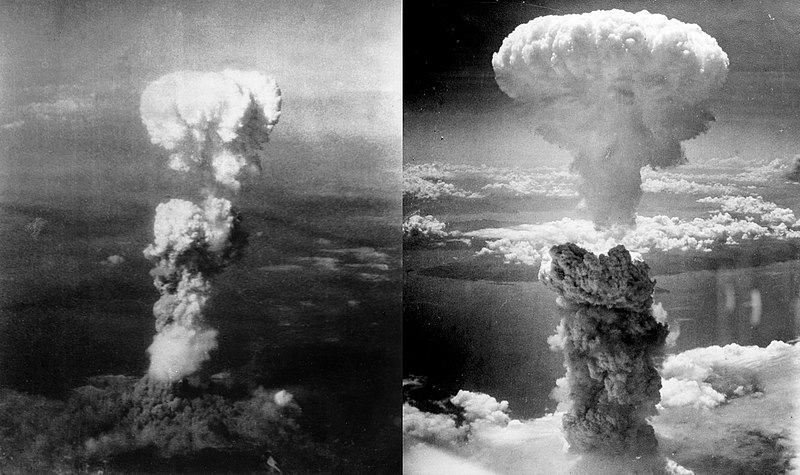
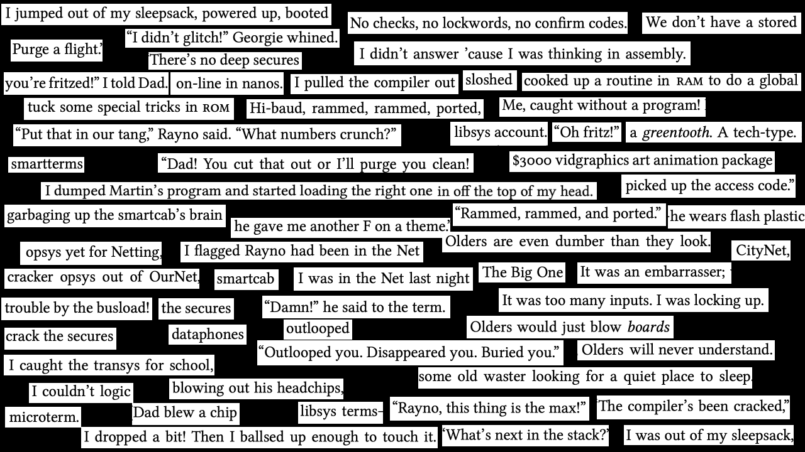
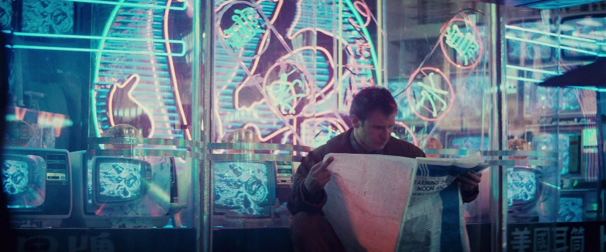
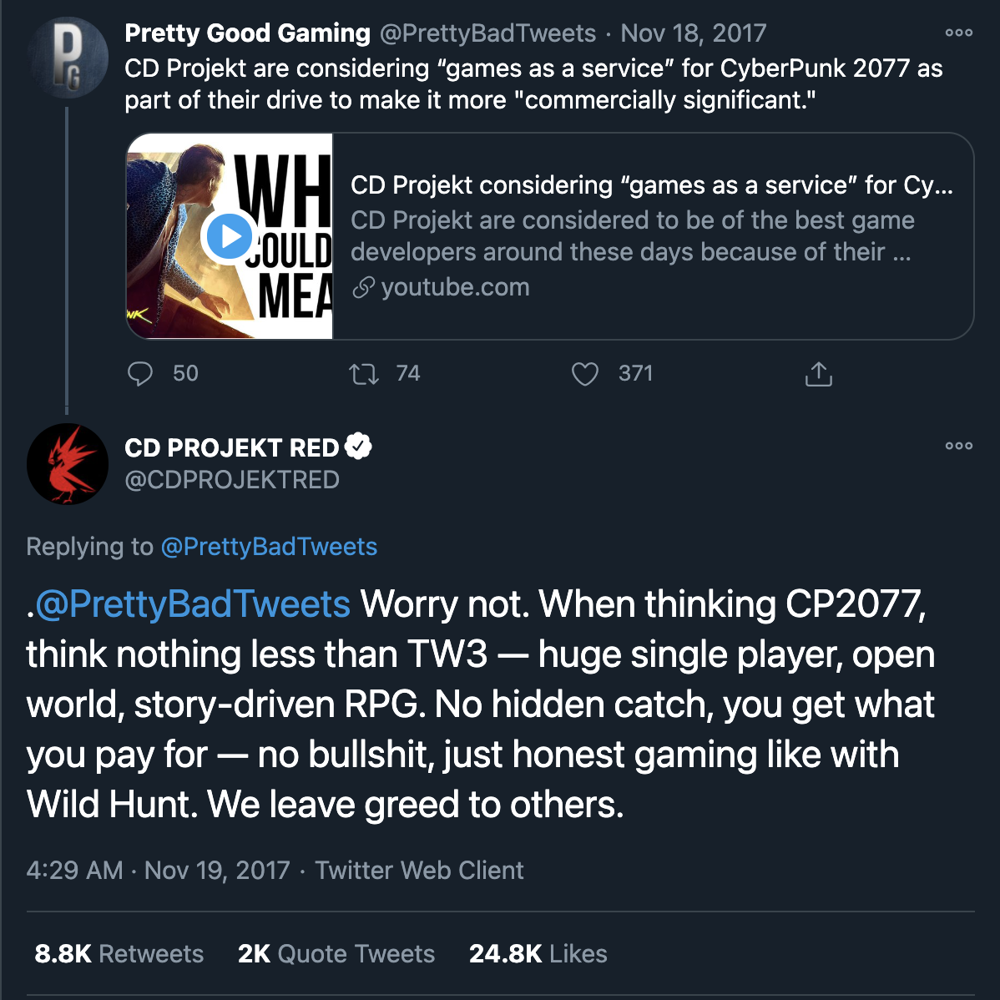

## 0. Genesis

In the beginning, there was the steam engine. Or actually, there wasn’t.

Cyberpunk visionary William Gibson remarked in a 2011 interview with The Paris Review:

> “So I didn’t think it was terribly original, my concept of cyberspace. My anxiety, rather, was that if I had thought of it, twenty or thirty other science-fiction writers had thought of it at exactly the same time and were probably busy writing stories about it, too.
>
> There’s an idea in the science-fiction community called steam-engine time, which is what people call it when suddenly twenty or thirty different writers produce stories about the same idea. It’s called steam-engine time ­because nobody knows why the steam engine happened when it did. Ptolemy demonstrated the mechanics of the steam engine, and there was nothing technically stopping the Romans from building big steam engines. They had little toy steam engines, and they had enough metalworking skill to build big steam tractors. It just never occurred to them to do it.”
>
> _William Gibson_

Cyberpunk was not so much the brainchild of one jacked-in script kiddie as it was a bunch of guys looking at the world change from underneath their feet. Why did cyberpunk develop when it did and what characteristics define it as a genre?

### 0.0 Why is cyberpunk?

Like Gibson said, nothing develops in a vacuum. Even some lonesome, grizzled hermit wearing a handmade loincloth in the mountaintops of Appalachia will have been raised, taught English, shown either poverty or wealth, shown a newspaper, a television, or a phone, something. These somethings after World War II (it always comes back somehow to WWII doesn’t it?) were:

- the “Golden Age of Capitalism”
- mind-blowing tech (computer? but also skin grafts and blood transfusions which even today sound futuristic as hell if you think about it)
- Japan = scary

To name a few.

Conforming American consumers just after the war were living in a dream, but in Europe… well it was a little different. The absolute destruction of entire countries prompted really sick art and new ideas (“philosophy”) about the world itself. Nihilism, post-modernism, expressionism, existentialism, eleganzaaism. If modernists were a bunch of arrogant, champagne-flute-holding snobs who believed in things like “truth” and “progress,” then post-modernists spray-painted a giant penis over that like the high school boys in your math class.

Post-modernism challenged the grand idea of “progress” (at some point I’ll make a post about this) from the modernists: that technology increasingly got better and better and only solved problems and bettered humanity. Maybe technology, they thought, created problems of its own.

Maybe technology not good? - Post-modernists

With this seed planted, however, the rest of the American entertainment industry moved forward with an optimistic—or at least politically neutral— view of the future. You had 1968’s 2001: A Space Odyssey and 1977’s Star Wars showing the wonders and various magics of The Future.

Leave this essence of anxiety, fear extract, and tech growth hormone to simmer for two decades. Serve with parsley.

### 0.1 How is cyberpunk?

The year is 198x (you decide). The American economy is… not the best. Still number one, but it’s definitely seen better days. (You should’ve bought more Baby Yoda merch you entitled snowflake) But you know who’s number two?

Japan. Let’s return to the three points I made earlier:

- the “Golden Age of Capitalism”
- sweet ass tech
- Japan = scary

Just as the American economy had a post-war boom (no pun intended, yikesss), so did the Japanese, and that… was scary.
In the minds of Americans, Japan was kamikaze bombers, ruthless imperialism, and an endless sea of cunning, single-minded killers. It was not Pokémon, anime, and cherry blossom trees.

Japan’s sudden status as the number two economy in the world meant that they were beating us at our own game; that they were hard-working, industrious, and impossible to compete with; that We were going to become like Them. The same racist rhetoric you hear now leveled against Asian immigrants.

So, we have anti-Japanese sentiment in the U.S. That’s one starting point. But who could ignore the impending death of capitalism and…

As the threat of nuclear war with the Soviet Union asymptotically approached 1.0, a lot of people were, well, freaking the fuck out. Anxieties over the Japanese domination of the economy, Soviet domination of the world, triumph of capitalism, and destruction of humanity were weighing heavy on the minds of the people. Some of these people… were writers.

Writers have an annoying habit of challenging norms and in this case that norm was the conformity of corporate life. In a world of endless suits, advertising, briefcases, and technological optimism, cyberpunk writers dared to ask “what if this guy had green hair?”

They challenged the idea of conformity (a cultural value in both the Soviet Union and Japan) to assert their own identities in a world that wanted to erase them. They challenged the idea of never-ending technological progress, the Modernist idea that technology was going to get progressively better and better for the benefit of society. They embraced pop culture, the immediate future and potential present, and the blurry lines of “what is good for you is not good for everyone”—all postmodern takes.

In the 80’s, you had the likes of Reagan and Thatcher who embodied the neoliberal, let-er-rip capitalism we see in cyberpunk worlds. Cyberpunk dealt with the logical extreme of this economic system, where citizens were left to scrap and scavenge on their own in a world where the upper class lived in techno-luxury.

The battle between capitalism and communism provided themes of class conflict, the death of democracy, and corporations playing an increasingly large role in our world without much regulation. There was a real feeling that corporations—specifically Japanese multinational conglomerates called zaibatsu (Mitsubishi, Nissan, Panasonic, Toshiba, and Kawasaki)—were going to take over the world and America would soon be a faceless mash of computers, biomedical operations, conformity, and Japanese corporate life.

### 0.2 What is cyberpunk?

With that cheerful bedtime story out the way, we can now say that cyberpunk is:

> A literary genre of science fiction influenced by the noir detective novel featuring themes of individualism, human identity, technology, globalization, and capitalism set in a world of conglomerates and inspired by Japanese culture and architecture.

Say that five times fast for your robo-maid.

Reflecting urban anxieties at the time of the future of America and democracy itself, cyberpunk authors imagined a world not so far away where corporations ruled, computers had taken over, and “humanity” itself was no longer clear. Consequently, the typical cyberpunk protagonist was The Individual: those who dared to stand against the crowd and declare “No mom, I will hack our toaster.” In the vein of the noir detective, they are anti-heroes: criminals, hackers, outcasts, and misfits. They are… like You, troubled by the world but feeling too powerless to change it.

Antagonists in cyberpunk are a bit different than usual. Often, there is no singular bad guy but an entire company, computer network, or government. There is a “collective” evil, which goes back to the idea that conformity is bad and the protagonists are the ones who choose not to conform. The protagonist is “fighting against the system,” hence cyber-punk. Punk subculture developed in the 1960’s as a movement for individuality and encouraged body modification, resisted corporatism, and questioned authority of all sorts. It’s not hard to see how cyberpunk was influenced here.

## 1. Replication

### 1.0 Fritzed!

The term cyberpunk itself comes from Bruce Bethke’s 1980 short story _Cyberpunk_. I actually read it and aside from the heavy use of networking talk that sounds straight out of Linux net-tools and the unconscionably cheesy 80’s cyberslang:

Aside from that, the story isn’t bad. There really aren’t the general themes we associate with cyberpunk, however. The protagonist has a very 1950’s traditional family life; there’s no corporate overlords (there’s even a public library and the one business owner is portrayed positively); no globalization (aside from tofu, there are no Japanese influences or menacing zaibatsu). The story just deals with a couple of… well… cyberpunks: kids who get into trouble using their advanced technological skills.

**(SPOILER ALERT)**

The protagonist, Mike, is actually kind of a massive jerk? His dad grounds him for ditching school and Mike wipes out his parent’s life savings, fires his own father, cancels vacations… It’s not a good look for Mike. Even calling his character an anti-hero is a stretch because Mike doesn’t really fight for the greater good. He does technically rebel against “the system” by hacking systems and distributing money, but it’s not for some greater ideological reason or sense of morality. It’s just a teenager doing shitty things.

**(END SPOILER ALERT)**

What I think does come through in the original _Cyberpunk_, however, is the idea of technological progress without a corresponding moral progress. This is a huge theme in cyberpunk. On the inspiration for the book, Bethke says:

> The kids who trashed my computer; their kids were going to be Holy Terrors, combining the ethical vacuity of teenagers with a technical fluency we adults could only guess at. Further, the parents and other adult authority figures of the early 21st Century were going to be terribly ill-equipped to deal with the first generation of teenagers who grew up truly “speaking computer.”

So, we see a fear that technology will supplant traditional forms of authority. Corporations will succeed governments. Computer networks will erode family and social networks. Those who control information will control the world, leaving the rest of us at the mercy of their fingertips, touch pads, and “wafer displays.”

### 1.1 Electric Sheep

So, if Bethke’s own _Cyberpunk_ is not a good start for the cyberpunk genre, then what is? Well, most people point to Ridley Scott’s 1982 _Blade Runner_ and William Gibson’s 1984 _Neuromancer_. Just the names have the same “cool prefix + active, human noun” Cyberpunk does.

_Blade Runner_ was an adaptation of Philip K. Dick’s classic 1968 _Do Androids Dream of Electric Sheep?_ with the name coming from a novel about a smuggler of medical supplies (i.e. scalpels). The film of course features Harrison Ford and that’s all you need to know about it.

But if you want to talk details, _Blade Runner_ as a film brought a vivid visual language to cyberpunk, one of neon, grit, claustrophobic Japanese urban cityscapes, and rain. Thematically, _Blade Runner_ asks “what does it mean to be human?” and “can AI have sentience?” You really can’t ask for a better cyberpunk film except for the contemporary masterpiece _Ralph Breaks the Internet_. It (_Blade Runner_, not _Ralph Breaks the Internet_) deals with biological engineering, artificial intelligence, corporate control, the police state, late capitalism, globalization, the nature of humanity, individualism, and the questionable “progress” of technology. _chef’s kiss_.

I wonder if he knows Kimye divorced

_Neuromancer_ is a book by accomplished and rambling sci-fi nerd William Gibson in which he invents YouTube vloggers called “simstim actors.” It deals with most of the same themes as _Blade Runner_ plus cybernetics, drug use (very important for the whole “punk/social outcast” thing), and sex work. It more directly shows the threat of corporations under the hyper-capitalism envisioned in the 1980’s and how their actions and general fuckery affects the individual lives of real people (or are they?). Compared to _Blade Runner_, _Neuromancer_ reads almost Lovecraftian, as if technology really was some giant silicon wave that tsunami’d society. Its writing style is inspired by Beat poetry and William Gibson is certainly more writer than programmer, which turns out not to matter much at all. Using words alone, Gibson paints a picture just as vidid as _Blade Runner_:

> “He’d found her, one rainy night, in an arcade.
>
> Under bright ghosts burning through a blue haze of cigarette smoke, holograms of Wizard's Castle, Tank War Europa, the New York skyline... And now he remembered her that way, her face bathed in restless laser light, features reduced to a code…”
>
> _Neuromancer_, Part One: “Chiba City Blues”

In the same Paris Review interview from earlier, we hear about Gibson’s world at the time from a bird’s eye view, at the level of social changes and societal upheaval:

> “Some of these [guys from my hometown were who drafted in the Vietnam War] were people who had no intention of ever leaving the United States. There were suicides, there was a lot of drug abuse. Nobody knew that a few years down the road it would all be over and that all would be forgiven. And that wasn’t my situation. I was there because I liked it there.
>
> It was 1967, and the world was in the middle of some sort of secular millenarian convulsion. Young people thought everything would change in some Rapture-like way. Nobody knew what it was going to be like, but ­everybody knew that pretty soon everything would be different.”

Young people at the time felt like everything was going to change (before they sold out and became yuppie trash). Of course, this was the 60’s and you knew that already. But it’s important to keep that in mind. Nothing develops in a vacuum. Steam engine time.

The more immediate inspiration came from an arcade as Gibson recalls:

> “I was walking around Vancouver … and I remember walking past a video arcade, which was a new sort of business at that time, and seeing kids playing those old-fashioned console-style plywood video games. … Even in this very primitive form, the kids who were playing them were so physically involved, it seemed to me that what they wanted was to be inside the games … and the machine in front of them was the brave new world.
>
> The only computers I’d ever seen in those days were things the size of the side of a barn. And then one day, I walked by a bus stop and there was an Apple poster. The poster was a photograph of a businessman’s jacketed, neatly cuffed arm holding a life-size representation of a real-life computer that was not much bigger than a laptop is today. Everyone is going to have one of these, I thought, and everyone is going to want to live inside them.”

So, society’s a-changin’ and tech even faster. And cyberpunks didn’t think it was all over the rainbow for happier days. And who could blame them? I mean, the world was pretty much a shit show.

This brings us to the interesting and eternal question: what would a modern cyberpunk look like? The thing is… cyberpunk is not so much _speculative_ as it is _reflective_: a specifically and uniquely 1980’s vision of the future if the circumstances at the time continued their logical extremes. Which they didn’t.

Japan hit a “Great Recession” in the 90’s called the “Lost Decade”; such imagined technology as the internet came into being, with less than expected results (less cultural revolution, more GeoCities pages for divorced dads); crime rates plunged in major cities across the U.S.; and — most importantly — it just wasn’t applicable anymore. From income inequality to the limits of humanity, most of cyberpunk’s genuinely substantial and interesting themes were either washed out by neon visual effects or rendered pointless because technology came, saw, and conquered that idea already.

As to a “modern cyberpunk,” my personal take is that there isn’t one. I know I’m gonna make some people mad with this and you’ll just have to take me to court for it because in my view cyberpunk is just such a context-dependent genre it cannot be ripped out of the 80’s like a 3 MB RAM card and stuck into the 2020’s where 2 TB can fit on your pinky finger. We’re not worried about Japan taking over the world. In fact, it would probably be welcome at this point. With five different computers in every room, people don’t seem so concerned about the “invasion” of technology in general as they do about dancing robo-soldiers and tweets starting nuclear war. Our AI still isn’t advanced enough to be threatening. All it can do is recommend half-good songs or, I don't know, turn on light bulbs.

Anyways, my `libsys` microterm has crunched the program and it says we’re finally ready to talk about It, The Big One, the zaibatsu itself: _Cyberpunk 2077_.

## 2. Fork

### 2.0 The Video Game Stuff

_Cyberpunk 2077_ is only the most recent game from video game studio CD Projekt. Thank god, I am not a gamer, so this part is going to be minimal.

CD Projekt’s claim to fame was _The Witcher_ series, which was highly, highly praised and even known as one of the greatest open world role-playing games ever made. They were specifically praised for _The Witcher_’s storytelling and world-building. However, it’s worth noting the world in question was that specific fantasy brand of “medieval Europe.” You know, castles, swords, metal armor, vaguely European names like Gerfhender, Nadya, Beowulfryk, etc. This is a much smaller, niche area to cover compared to something like cyberpunk which needs dense, diverse populations and a basically infinite amount of stores, shops, and restaurants.

Some say the success of _The Witcher_ made CD Projekt cocky, that they thought they could tackle any and all open world games now since they did the last one so well. I’m not so sure if I believe this. It seems like the developers on _Cyberpunk_ knew that the game needed more time and was in no shape to ship, but management insisted. _Cyberpunk_ had already been delayed three times in its production process, with each subsequent delay chipping away at the excitement surrounding the game and even faith in the company itself. The company executives pushed the product anyways, despite knowing that there were doubts from developers. All the while, the product was being marketed with trailers, teasers, and false promises. Christmas sales and a short-sighted view of the consequences of a bad launch took precedence over their best intentions for the consumers. It’s like at some point the power of the company got out of hand and the average citizen paid the price, getting a buggy, unfinished product that was not adequately tested.

God, that almost sounds familiar.

**SPOILERS BELOW.**

You start in Night City with someone called “V.” You choose their background, but no matter what you choose, you and a friend/acquaintance end up getting contracted by a local gangster to steal a high-tech “chip of immortality.” This chip lets you upload your consciousness into another person, which is appropriately cyberpunk. The heist goes awry as expected and V ends up with Keanu Reeves in their head. If the chip is not removed within a few weeks, V will die from Keanu overdose (sign me up) as Keanu’s consciousness replaces V’s own. Typical shenanigans and antics arise, but eventually the two discover “Soulkiller,” which is the program that imprisoned Keanu after his terrorist attack made by the love of his life, Alt Cunningham. She was kidnapped by Arasaka and “rescued” by Keanu, except that he actually killed her and stuck a clone of her inside a prison called Mikoshi. The Emperor of Arasaka, Saburo, commissioned the development of the chip because he was getting old and wanted immortality since his son was a piece of shit and couldn’t run the company. There are then five separate endings all of which are combinations of either V, Keanu, the CEO of Arasaka, or nobody getting V’s body. In my view, the truest cyberpunk ending is the default one, where Arasaka surgically removes the chip from V’s head and V signs a contract giving Saburo their body in exchange for being enrolled in the “Secure Your Soul” program, guaranteeing V’s soul is preserved inside Mikoshi.

Now that that’s out of the way, is this cyberpunk?

### 2.1 The Cyberpunk Stuff

Yes, but it gets a B minus.

I’m not gonna talk about how Night City is too sunny or how everything is just a little too clean because those are really just surface level things that might be patched later. That’s not to say that the aesthetics don’t matter, as cyberpunk is an especially aesthetic-heavy genre. It's just that slapping on rain and _Tron_ grids isn’t enough.
_Cyberpunk_ deals with the way ordinary people are crushed under corporations, the struggle to find purpose in a hopeless world, personal identity and choice, and what it means to really “die.” Cybernetics as a motif supports the larger theme of the nature of humanity, as does sex work for how capitalism sucks the life out of absolutely everything. Yes, there are references and nods to other nerd lore, but where _Cyberpunk_ feels the strongest is in how it approaches the individual.

Keanu’s Johnny Silverhand seems to be the strongest symbol of individualism there is with a fiery hatred for the corps. However, we find out that the Johnny that we see is a deep copy of the original. He retains the memories, personality, and (debatably) consciousness, but it’s not clear if our Johnny is the same as _the_ Johnny. When Johnny takes control of V’s body, whose body is it? _Cyberpunk_ itself believes that it really is Johnny’s now, just a different form of him. [^1] However, a more conservative view might hold that the “real” Johnny died in the oil field he was dumped in.

But the individual does not always triumph. We see some of the most sympathetic characters in the game fail in their attempts to dig themselves out from corporate control. These characters might represent the optimistic American dream, that by hard work and skill you can climb the social ladder and better your circumstances.

Or not… Jackie is nothing but a pawn; Evelyn is sold to the highest bidder; Yorinobu faces the wrath of Arasaka. In true cyberpunk fashion, however, the corp always wins. These are all cautionary tales against trying to beat the Powers That Be.

Overall, Cyberpunk did an excellent job at incorporating cyberpunk elements and even themes, but left considerable room for improvement. I want to know more about the tech-accelerationist gangsters known as the Voodoo Boys and cyberspace. Cyberpunk definitely qualifies as a cyberpunk work, even one made in 2020. The question however, is how cyberpunk can you be when your urban streets look like Sunday morning traffic?

[^1]: https://youtu.be/gbLgzYcH338?t=562
