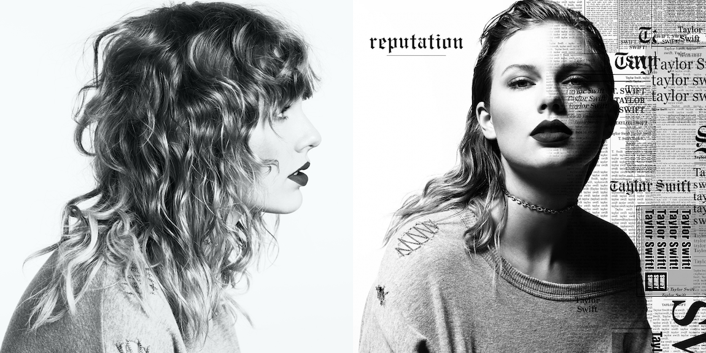
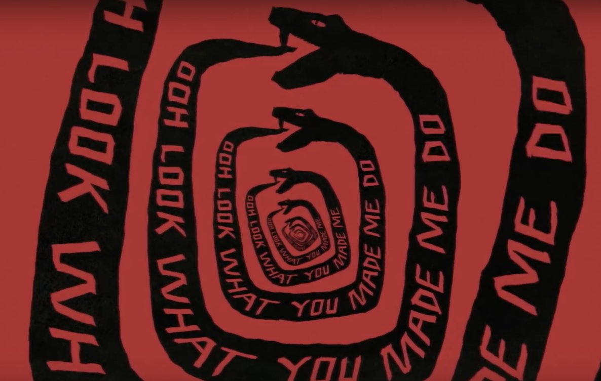

> *Every one became my friend from his own opinion;*
>
> *none sought out my secrets from within me.*
>
> \- Rumi

It is rare to get a mainstream artist honestly, painfully, and fully describe the details of a breakdown or public falling out. But when they do, it can be the fire on the side of the road you just can’t look away from. Britney Spears’ *Blackout* and now Taylor Swift’s *reputation* come to mind, both tearing away the curtains of long-cultivated public images to reveal a rougher, more genuine truth. Both albums saw the American sweethearts at their worst, with failing relationships, public feuds, and media criticism shoved into the foreground of their narratives. If I had one wish for Taylor’s take, though, it would be to be more like Britney’s: to be more radical, more extreme. However, seeing as *reputation* was the highest-selling album of 2017, marking the fourth time Taylor has surpassed the 1 million opening week sales mark, it’s safe to say this was a reasoned choice. In fact, much of the album reflects Taylor’s incomparable cleverness and, dare I say, brilliant thinking. These are somewhat bold claims so let’s take a deeper look to see what I mean.

## Release
A week before the lead single was released, Taylor blacked out all social media including her website. This would later become clear as a reference to “killing off” the “Old Taylor.” Two days later, she posts a grainy video of a snake tail. Over the next two days, she posts two more videos, completing the snake with a snapping bite. On the final day of the snake reveal, she also - without any other warning or hint - drops the album title, cover art, and release date. It is here that we must discuss some of my favorite parts of the release!

*reputation* was released on November 10, 2017: 11/10/2017. Her previous album, *1989*, was released on October 27, 2014. Between those two dates, there are 1,110 days. 1110. 11/10. She released *reputation* exactly the same amount of days after *1989* as the date itself. This also marked the three year anniversary of the release of her single “Blank Space,” which was a parody of her **reputation** that the media had constructed of her. Genius already! 

Also, once you consider this minimal promotion for the lead single, “Look What You Made Me Do,” it makes it all the more impressive that the song broke the Apple Music, Spotify, and YouTube records for the most streamed single in 24 hours. Now that we’ve talked about the release date, we get to analyze the cover itself, one of the most iconic (or notorious) pieces of the discussion.

## The Cover
The cover for *reputation* is a style of design known as “anti-design,” which emphasizes deliberate violations of common design practices; obnoxious and excessive use of typography and text; asymmetrical placement; stark, bold, and often clashing color choices; and repetition of text, among other things. There are many perceived or conceivable implications of this (from showing a rejection of establishment to capitalizing on meme culture), but I won’t be discussing those here. Rather, what is important is that the album cover has a symbolic meaning representing the entire album theme as a whole: that there are two sides to every person. There is the true side, free of remark and judgment, and there is the public side, that culmination of words, ideas, and stories of that person often seen before its counterpart, i.e. their *reputation*. Here, we see Taylor literally split into black and white. Either she is perfect and clean, the so-called “Old Taylor,” or she is hated and demeaned. The judgments of her, much like the album cover itself, are harsh, stark, and polarizing. Either you love it/her or you hate it/her. There is no in-between. This also hearkens back to a closing line in the album’s opener:

> There will be no further explanation.
>
> There will be just reputation.

The words which cover Taylor’s face get in the way of actually seeing her. Her reputation literally precedes her. Of course, we must also point out that the many many iterations of her name are references to newspapers and magazines, both places she was branded a liar, manipulator, or faux victim. This drives home the point even further: that the words about her obscure her actual personhood. In my opinion, it was not so much actual print newspapers that partook in this (because they are of higher professional standards usually), but digital “newspapers” or glorified blogs which get retweets on their inflammatory headlines that were the worst offenders. But I guess those publications have a less dramatic aesthetic to them. 

On the cover, Taylor breaks tradition and faces the camera dead center. The meanings for this are fairly straight-forward; she is no longer shying away from material as she has done in the past. There are fewer filters on her now. This carries over to the rest of the album, where Taylor takes unprecedented steps in her career, openly cursing, talking about sex, and drinking. In the past, she has used tangential references (“I’ll do anything you say if you say it with your hands,” “Lights are off, he’s taking off his coat,” etc.) for sexual activities, but - as we will see later - on *reputation* she strips away all those frills, bushes, and petals and has, for all it’s worth, the truth. 

Taylor also wears two interesting pieces of clothing on the cover: a chain necklace and a carefully torn sweater. The chain around her neck represents how she has been bound to her reputation for almost all her life, the level of control it has had over her (as she later explains in “Delicate”) to the point where it’s choking her. Taken with the theme of crime throughout the entire album and the direct, head-on style of the album cover, this is Taylor’s mugshot. She feels imprisoned by her reputation and by people who do not care for her having huge amounts of control over her. This goes with both her relationship with the media and her record label, who were at the point of selling her entire body of work to one of Taylor’s tormentors. It is also worth noting how unfair a picture this cover paints: anyone and everyone can say anything they want about her, damaging her reputation in the process, but she can’t say anything back in defense. The chain will also become important later, as we will see in “Call It What You Want.” Compare an approximation of the *reputation* CD lyric booklet with the following mugshot of Suzanne Somers: 

The sweater is interesting due to the chain-stitched tear on her right shoulder, which has exactly five triangular circuits running between the tear. Each circuit represents each of Taylor’s past five albums. Due to her rather confessional songwriting style, each album represents another time Taylor has had to stitch herself back together after experiencing heartbreak. And she will do the same this time. Despite her reputation being tarnished, these stitches remind us that Taylor has done this at least five times before, and this will be just another battle scar she bears. It is a subtle, but extremely powerful symbol.

Now that we have discussed the meta information of the album, the rest of this post will be a track-by-track analysis of *reputation*.

# ...Ready For It?
This song literally begins with Taylor clearing her throat, signaling that she is ready to let loose, which also perfectly matches with our previous idea that the chain on the cover shows us how she has traditionally bit her tongue. No longer. She metaphorically and literally clears her throat to let the listener know that what will follow is a departure from her usual music. 

And boy is it! The track, sonically, features harsh, “crunchy” bass lines reminiscent of both Britney Spears’ “Piece of Me” and Kanye West’s “On Sight,” both of which opened their respective albums as well! This seems to be a common trope then in the genre of albums-made-during-breakdowns.

Lyrically, Taylor opens saying she “knew he was a killer,” immediately introducing the theme of crime which carries throughout the rest of the album. Here, her and her lover are both criminals, which will become important as *reputation* chronicles how Taylor, despite committing social “crimes,” found true love and companionship. Already, she and her lover  are a match made in Hell! What is also interesting is the power dynamics of this verse. Taylor says that if “he’s a ghost / then I can be a phantom / holding *him* for ransom,” where the emphasis on “him” is my own. Notice how Taylor is the one with the power here, not the man! This is a departure from her previous works which feature the man as the active character. The man drives the car, breaks her heart, lies or cheats, etc. Here, she is the active perpetrator. 

Ending the first verse, Taylor says “I keep him forever / Like a vendetta,” highlighting two central themes: love and revenge. These are weaved throughout the album in its entirety, and this presents a perfect example. 

Now, we arrive to the chorus and I must introduce a potentially confusing concept: the real Taylor is in the choruses. Remember how in our discussion of the cover art, I mentioned there are two sides to Taylor presented? Well, the verses of the songs generally represent the “public” Taylor whereas the choruses (chori?) represent the “true” Taylor. This split is done both lyrically and musically, with verse Taylor pseudo-rapping and chorus Taylor singing more melodically. So, when Taylor bombastically declares she holds her lover for ransom and keeps him forever like she does her grudges, that, much like “Blank Space,” is a parody of her reputation. That is what people think of her as, but it is not her true self. Her true self is revealed in the choruses. Notice the much softer proclamation “I know I’m gonna be with you, so I’ll take my time” compared to the verses. It sounds much more like Old Taylor, right? That soft, romantic sentiment? 

The pre-chorus also has an interesting line stating that if her lover touches her, “he’ll never be alone,” which at face value is a sweet, devotional lyric promising her companionship. However, it also has a double meaning reflecting the contagious, dangerous power of her fame. As Taylor has seen time and time again, her celebrity creates nearly insurmountable challenges on top of the existing, inherent difficulties of relationships. Considering both meanings, this line perfectly reflects the compelling dichotomy that is Taylor Swift: at once, both a heartfelt romantic from a small town and the biggest pop star in the world. “No one has to know,” Taylor sings, but does she really believe that? 

And then the eponymous “Are you ready for it?” launching the second verse. This line, as well as the title, have multiple meanings, as do most things on the album. It of course serves as an album opener to us listeners asking us if we are ready for the dramatic face-heel turn Taylor will be taking, but also as an in-universe question to her lover, to whom it has much more gravity. She is asking him if he is ready for the onslaught of publicity, media hounds, speculation, and gossip. Once you consider that this line is straight between both the true Taylor chorus and the parody Taylor verse, between the genuine concern over her reputation and the brash rhetorical question, its placement is nothing short of genius. It serves as a perfect bridge between the two Taylors, having different meanings for each. 

Taylor draws from the story (and pun) of Elizabeth Taylor and Richard Burton in the second verse to make the comparison between her and her lover. This is not just an apt comparison of famous couples, but a tie back to the general **reputation** of Taylor Swift. Like Liz, Taylor finds her art and talent minimized at expense of vapid gossip about her love life. Of course, there is a certain irony to this, as it is exactly the virulent gossip in the first place which adds to the pressure of dating while famous, thereby increasing the likelihood of a breakup, which just generates more gossip! The magazines have really worked out this one. “Planes, trains, everything stops for Elizabeth Taylor, but the public has no conception of who she is,” Roddy McDowall tellingly said about Liz Taylor and I think both the comparison to Taylor Swift and the context of being in *reputation* speaks for themselves. 

The crime theme also continues through the second verse as Taylor says her lover “can be her jailer.” That is, he can imprison her. Compared to earlier, where we see Taylor is imprisoned or controlled by her reputation, this is shifting the control instead to someone who supposedly cares about her. We will talk more about this in “So It Goes...” and “Call It What You Want.”

## End Game
A morning after the gritty bombast of the previous track, “End Game” starts with gentler, listerine green synths and the chorus. This track gives us insight into Taylor’s state of mind in ways the other, more aggressive earlier tracks of *reputation* don’t. The linearity of the album is not a strict chronological linearity, but rather an emotional, personal linearity, describing Taylor’s journey from one state of mind to another. Here, we see her desire for more from her current relationship. She wants to be her lover’s “end game,” that is his goal romantically. However, the term “end game” also refers to few final moves finishing a game of chess, suggesting that Taylor feels she is playing a calculated game here. She *wants* to be his end game but it’s clear that they both have reputations for breaking hearts and it’s very unclear what is actually going to happen. She “know[s] what they all say” about her, that she is a serial dater, that she goes through men, that she doesn’t commit, but she affirms here that she “ain’t tryna play” games with him. Here, we see Taylor grappling - albeit in a light-hearted way - with the implications of her reputation.

Once again, the two central themes of love and reputation feature here, but in a much lighter, optimistic way than they do in “Delicate.” Taylor knows that her reputation is problematic and is trying to ease that pain and judgment by escaping into a relationship. What is interesting is her saying that she doesn’t “want to hurt” him. This can be a simple way of saying she doesn’t want him to get affected by her fame and current reputation, but it also calls back to the characterization of them both as criminals, who each might hurt the other. In a way, this marks a sobering up from the impetuous bravado of “...Ready For It?,” acknowledging that, yes, maybe this is worth saving. 

The third verse is Taylor’s and is the most enlightening into the subjects of the song. She finds herself in an intoxicating relationship where, despite her best efforts “to forget it,” she couldn’t. She also gives a very tongue in cheek line about how she buries hatchets, but “keep[s] maps of where [she] put ‘em.” This line can be referencing the persona Taylor is playing into, where she does not truly forgive people who have wronged her, but keeps them in her mind when she needs to “play the victim,” but it can also be in a romantic context. That is, she fights with her lover and even though she says everything is okay, she’ll pull out these past grievances in future arguments.

The second half of the third verse is not only beautiful, but also thematically important. She says that she can’t “let [him] go,” which is echoed in the closing track “New Year’s Day.” Her lover has put his “hands prints on [her] soul,” which, aside from being just an amazingly poetic line, introduces a motif throughout *reputation* of him leaving a permanent mark on Taylor. See “Dress.” Taylor introduces another common motif here which is the color gold to represent true love. “It’s like [his] body is gold,” she says, showing that to her his entire being seems perfect. It is no coincidence that this follows a line mentioning alcohol. As we see later, alcohol is pervasive through the album, especially when the two are together. Careful not to dismiss this as mere frivolity though. Taylor was nearly 28 years old when *reputation* came out and not once was she photographed with a drink in her hand. Her public persona was so heavily controlled, managed, and filtered to be wholesome and family-friendly that she missed out on a lot of typical experiences for 20 somethings. So, when Taylor sings about alcohol, it is not for reckless shock value, but to show her progression into allowing herself the mundane indulgences that have been withheld from her for her entire formative years (12-27 years old). It may be hard to view the mention of alcohol as something with such a deeper meaning than drunkenness, but here it is undeniable.

## I Did Something Bad

<small>*There will be no further explanation.*</small>

But if we must: “I Did Something Bad” marks a clear turning point for Taylor and her “old self.” From the sharp contrast between the optimistic “End Game” and *this*, we can infer the relationship turned sour, as did her public image. Narratively, the song propels us into the beginning of the end of Old Taylor. Let’s start at the beginning...

The track starts with staccato strings, which set the mood for a devilish, villainous atmosphere. We then get the first line “I never trust a narcissist / But they love me.” Already a lot to unpack here! Taylor is clearly leaning into the irony of the line, calling someone else a narcissist while claiming they love her. Is she saying then that she cannot be trusted since she too is a narcissist? This plays into the line “I don’t trust nobody / And nobody trusts me” in “Look What You Made Me Do” perfectly, as she cannot trust anyone else since they are narcissists and no one can trust her as she’s a narcissist. There is also another level of irony though, which is the established “face” of Taylor portrayed in the verses of the songs. These are not Taylor’s genuine feelings, but rather those of a character she feels forced upon her. This becomes more apparent with the next lines “So I play ‘em like a violin / And I make it look oh so easy.” The media has painted this picture of Taylor as a master manipulator, both on a personal and career level, saying that she plays the victim to garner sympathy but commits her own calculated actions that are equally as bad. Here, Taylor takes on this act, saying that she really is this puppeteer, masterminding everyone around her with ease. Going even *further*, there is a third level of depth to this line which is when you take it within the context of the overall album. In this interpretation, the narcissists in question are the media, who love to write headlines about Taylor as a villain. So, exactly as she does in this song, she plays into their expectations of her to show exactly how ridiculous they are, a tactic also used on LWYMMD. In both songs, Taylor anticipates the negative media reaction to both stemming from the fact that the media will take the songs at face value, confirming their preconceptions of her. However, she is one step ahead, “playing [them] like a violin” with intentionally inflammatory songs knowing their response in advance. If this sounds confusing, wait until the section on LWYMMD for a more concrete explanation!

This first opening stanza also echoes the same sentiment as “...Ready For It?” of both her and her lover being “guilty” or otherwise criminal. Overall, not a perfect relationship! We will see this same, bad-loves-bad idea throughout much of the album. 

The pre-chorus introduces the motif of burning, as in burning Taylor alive. Of course, this brings to mind the Salem Witch Trials and general witch hunts. The historical practice has been employed recently to describe unfair public outrage and attacks of people, usually women. It is clear that Taylor feels the subject of such witch hunts. It is also interesting to note that this song was written sometime in 2016 or 2017, following the real-life political witch hunt of Hillary Clinton. What is also interesting with the witch hunt metaphor is that during real life incidents, women were bound to stones and thrown into a river. If they sunk, they were innocent but dead. If they floated, they were guilty and then burned alive. Basically, you were damned either way. Taylor has spoken out since the release of *reputation* as feeling this exact way surrounding her political involvement: if she did not speak out, she was criticized; if she did, she was seen as a liability. Either way, she can’t win. This also ties into the overall theme of punishment, whether or not such punishment is fair or just. 

Now comes the iconic lyric “If a man talks shit, then I owe him nothing / I don’t regret it one bit ‘cause he had it coming.” This is not so important thematically, unless you read it as establishing her newfound independence and freedom from the opinions of others, which it definitely is. Although, as a theme, independence is less prominent here than it was in *1989* and less so than crime. But the line is definitely emblematic of the overall feel of the album and represents a new boldness from Taylor never seen before. However, there is an application of justice at work here whereby Taylor is seem as punished unfairly (i.e. no matter what) but this man “had it coming.” The sentiment of karma and of revenge also features in LWYMMD. 

The chorus then starts off with the rumble of a rolling bass line and the words “They say I did something bad.” The line touches on the concept of Taylor’s reputation (what people are saying about her) being tarnished (they are saying what she did was bad), but notably she never actually utters the words “I did something bad” alone. In fact, she questions the judgments placed on her actions in the first place, once again a rebuke of authorities which have historically held her back and choked her off. “Then why’s it feel so good?” she asks rhetorically, relishing in her personal satisfaction. This unapologetic attitude is written all throughout this song in particular. Indeed, the next stanza she declares she would “do it over and over and over again if [she] could.” This distinguishes itself from past declarations of vengeance in that Taylor here relishes in revenge, using it not just as a means to an end but enjoying the act itself. Put differently, she is enjoying the journey more than the destination itself, a decidedly more wicked route. 

The hook. Just. The hook. Despite having no lyrical content, the pitched down, demonic rattling of Taylor’s voice creates the perfect balance with the string plucking intro to fully realize the vengeful spirit Taylor wields. Between the sharper connotations of a conniving villain and the impressively brute vocalizations, Taylor propels the listener into her jarring, hot-blooded high, while at the same time showing a self-awareness that this is an expression of her anger playing right into her reputation. 

The second verse sees Taylor pushing the role of the villain from vengeful to vengeful *and greedy*. After being criticized in a dispute with Apple Music and Spotify, many people who were used to streaming her music were not happy. [^1] “If he spends my change, then he had it coming” Taylor spits, reiterating her unapologetic attitude towards all her so-called crimes.

The next highly relevant part to this song is the bridge, which completes the witch hunt motif.

> They’re burning all the witches
>
> Even if you aren’t one
>
> They got their pitchforks and proof
>
> Their receipts and reasons...
>
> So light me up...
>
> Go ahead and light me up

Of course, Taylor acknowledges the fact that this persona in the song is just a character. She’s neither a witch nor a supervillain, but it doesn’t matter. People believe what they believe and her reputation speaks for itself. People will come to the conclusion before the facts and use any “receipts and reasons” to back up their opinion after the fact. This was indeed a lot of the rhetoric surrounding Taylor from 2016-2017 and, despite having a relatively minor fight by celebrity standards, digital “newspapers” began dragging up things from 2008 to justify their narrative that Taylor was always such a villain. It didn’t matter what the “truth” was, only people’s perception of it. Taylor resigns from the argument altogether, going with the theme of her reputation dominating her true self. It also marks a crucial lesson in our protagonist’s journey of learning to value what truly matters, the opinions of people who care about you, over what doesn’t, the opinions of people who do not. It doesn’t really matter whether or not she is this villain. It doesn’t matter to the accusers and it no longer matters to Taylor. Instead, she shrugs her shoulders and says “If I’m a witch, then light me up,” an incredibly powerful statement.

A subtle reference here is that all of this bridge is auto-tuned very similarly to Kanye West’s “YEEZUS” tour rants. [^2] [^3] By this, Taylor implies that the so-called reasons for her negative depictions stem largely from the falling out she had with Kanye. I don’t believe this significantly contributes to the themes of the album, but I suppose it’s interesting regardless. 

## Don’t Blame Me
Narratively, “Don’t Blame Me” is the point where Taylor starts falling for her long-term love interest beyond anything before. Whereas before she was trapped in a relationship and looking for a way out, now she is looking in, unable to pull away from the relationship established with this man. In the title, there is of course the same theme of crime, punishment, guilt, and innocence going on here. 

We start with a similar character to the one Taylor was playing just last song: “I’ve  been breaking hearts a long time / And toying with them older guys / Just playthings for me to use.” At first, Taylor conforms to her reputation for being a serial dater, particularly with older men, but despite the age gap, she is the one in control. It also calls back to “...Ready For It?” with the line “[He] knew I was a robber first time that he saw me / Stealing hearts and running off and never saying sorry.” So, in the early stages of the album, it’s clear that Taylor definitely has the reputation for being a heart-breaker and a player.

However, the verse changes quickly when “something happened for the first time in the darkest little paradise.” Drawing from “Delicate,” this dark paradise might have been a night club or dive bar where her and her lover met up; drawing from *Lover*’s “Cruel Summer,” it might have been his house. Either way, she’s meeting up with a man who is clearly new to her life in some regard. 

The pre-chorus marks a narrative shift where, now, Taylor is no longer the predator, but the prey: “For you... I would waste my time.” He is worth changing her ways for, a similar theme to “End Game,” but with a darker, devotional twist including losing her mind. Her reputation comes up again when Taylor informs us that “they say ‘she’s gone too far this time.’” This is also strangely parallel to “I Did Something Bad,” where critics are deploring Taylor’s actions, but she no longer cares.

From here, the chorus is fairly uneventful in terms of narrative or theme. Besides the general idea of a toxic relationship again echoed from “...Ready For It?” and a renouncing of her ways showcased in IDSB (“I Did Something Bad”) , there’s nothing more here.

## Delicate
This track, however, shows the first real vulnerability from Taylor on *reputation*. Even with “End Game,” there was a sense of playfulness and a desire for more, but Taylor was optimistic about it despite it seeming one-sided on her part. “Delicate” presents the very honest, genuine consequences of having a tarnished reputation: your love life. While Taylor can lean into the satire and portray all the parodies she wants, that isn’t the true her. This idea of the “heel” and “face” first starts appeaing in this song. The “heel” is the villainous side to someone; the “face,” the heroic. With “Delicate,” Taylor starts showing her face more, but at the cost of reckoning with her reputation.

An autotuned voice starts us off:

> This ain’t for the best
>
> My reputation’s never been worse, so
>
> You must like me for me

Taylor is confronting a relationship which is “doomed from the start” due to her anxieties about its viability. She is worried, convinced even, that this is not “for the best,” and cannot be a good road to go down. However, she then has a strange sense of reassurance in the fact that her reputation is already the worst it can possibly get, so really what worse could happen? Her lover is finding her at her worst, so she knows that his love for her is genuine. Beyond genuine, he loves her instead of her status, money, or celebrity, which we will see more of in “King of My Heart.” Thematically, this is groundbreaking for the album and shows Taylor that, yes, while reputation is important, what is more important is character and the people who truly love you know your character before your reputation. It is *because* she has a bad reputation that she knows his love is solid. The theme of finding love not just despite but because of the chaos is also touched on in Taylor’s poem “If You’re Anything Like Me.” (Not quoted below.)

> We can’t make
>
> Any promises now, can we, babe?
>
> But you can make me a drink

Just like reputation, we see Taylor’s views on love mature here too. Whereas before, they were presented in very stark terms: reputation does not matter, I love you so much I would lose my mind, I hate you so much I don’t regret anything I did, etc. Now they are presented more nuanced: maybe my reputation does matter, but the people who really know me know my character; I can’t say that I love you yet, but let’s give it a chance; etc. Compared to “Don’t Blame Me,” Taylor is using a much more conversational tone and second-person pronouns all the way through, which helps to show that she is actually communicating with him. It’s subtle things like this that go a long way at separating the lust of “Don’t Blame Me” from the infatuation of “Delicate.” 

> “Dive bar on the East Side, where you at?”
>
> Phone lights up my nightstand in the black
>
> “Come here, you can meet me in the back”

The quotes on the lyrics to the chorus here are mine because I believe this stanza is, in line with the beginning of the song, a conversation. The album until this point has been set into extremes, with killers, robbers, witches, and drugs. Sounds cool if you ask me, but these have all been exaggerations and parodies of the truth. Taylor isn’t any of those things and here we’re seeing that. Her lover texts her, nothing crazy, but he wants to meet up with her, somewhere where nobody will see them. He isn’t dating her for publicity or attention. He just wants her: he likes her for her. 

Not only does the conversation theory fit better with the overall song, it also makes sense in the music video. At 0:20, someome hands Taylor a note which she reads at 0:47, just before she starts her escape out of the gala where she ends up... a dive bar! The note was him asking her to meet him at the dive bar on a less reputable side of town, hence the graffiti. 

Taylor then describes her love briefly which isn’t important thematically but narratively her description seems to link this man as the same man in “Gorgeous” with blue eyes. 

Always a poet, Taylor uses some interesting literary techniques here. She juxtaposes how she wants to seem with how she’s actually feeling inside. “Is it chill that you’re in my head,” she wonders. She’s keeping up with his casual attitude (imagine asking Taylor Swift to a bar over text!), but she’s falling for him. She leads in with “is it chill” but falls into “you’re in my head.” Doing so, she captures exactly the sentiment of infatuation, of falling for someone. Indeed, Taylor draws out “‘Cause I like you.’” She picks this back up more intensely in “Gorgeous.”

Don’t get too excited however, because “it’s delicate.” Given her reputation, it’s not as simple as just liking each other. Here, the two themes meet again: love and reputation. How much does one affect the other? Sure, we may like to believe reputation doesn’t affect love, but the reality is it often does. If they both have reputations for being heart-breakers, it’s hard to justify starting a relationship. On the converse, will her massive fame crush their budding romance? Taylor has seen it happen before (listen to “I Know Places” from *1989*) and she knows that, while talk is strong, love is... well, delicate. If this idea sounds objectionable to you, don’t worry, she’ll flip that idea by the end of the album. 

Moving from the East to the West Side, things are picking up and getting physical! She also describes him as “handsome... a mansion with a view,” saying that he’s beautiful both inside and out. But since she’s falling, she’s catching feelings and she doesn’t “want to share.” 

Taylor’s crush really reveals itself in the bridge. She asks him, rhetorically, if he dreams of her, because she dreams of him. In fact, she pictures them together as a full couple. She think about him “all the damn time.” Infatuation at its finest here, and Taylor is really realizing here that she wants to try and make this work. But her reputation is getting in the way. She must make a decision: is love stronger than reputation? Can she really shrug off her bad rap so easily? Can he? She doesn’t know yet, but as we’ll see in the next track, she’s at least made a decision. And that is where the album starts headed towards her current state of mind. 

## Look What You Made Me Do
And now we have arrived. The song that started it all. A song so deeply entrenched with Taylor’s mythos (and yes, concerning the sheer level of symbolism and references in the track and video, I feel comfortable calling it such) it’s almost impossible to do it justice. There are three different readings for this track: that concerning her real-life feuds and the specific details and references; her overall media reputation; and her relationship with her label, Big Machine Records. We will only be focusing on the latter two, as I feel those are more in-line with what Taylor actually wanted to convey.

### Overall Reputation
Reading the track this way, we see Taylor once again assuming a satirical caricature of her reputation in the media. However, she does not stop at just one character, à la “Blank Space.” No, she does practically **all** of them. Narratively, it is at this point after “Delicate” that she sees to ever move past her downfall and experience love, without anxiety, without worry, she must embrace her reputation as a fact of life, knowing the ones who truly love her will see her character. It’s a common thought that, since “I Did Something Bad” is more palatable to pop radio compared to the rather strange LWYMMD, why not have that be the lead single? Taylor needed to kill off that part of herself, both the part that cared and the part which people cared about for the wrong reasons: the people who only stood by her when she was #1, when she put out bops, when she was getting good reviews. Had she lead with IDSB, the exact same situation as *1989* would have arisen: surrounded by a group of fake friends and fans whose loyalty goes as far as she’s charting. By releasing LWYMMD, a track so ridiculous in its camp and parody, her real fans would know immediately what she was doing, and the fake ones would out themselves (at least until the release if the video). With this in mind, let’s first start with the track.

It opens with a grand overture reminiscient of “Nightmare Before Christmas” meets “Phantom of the Opera.” This then shows a strong contrast with the drop into the rest of the song, which is a thumping, bass-heavy, dark pop track. Taylor punctuates “I don’t like your little games / Don’t like your tilted stage,” referring to the media’s unfair treatment of her. This basically ties back to the cover art of the album itself, with the incessant, ugly words of the media dominating Taylor herself, who remains chained and held back from speaking up. She can’t win either way here. No matter what, people will force her into the “role... of the fool,” whereby nothing she does is right and everything she does (including what she does not do) is wrong. She becomes the butt of every joke, as anyone who remembers the constant “snake” jokes can attest to. This line is also a nod from Taylor that she is in fact playing a role here. At least in the media’s eyes, she has no choice. They are going to say that “the gun was [hers]” anyways i.e. that she is guilty of any drama involving her. Either she plays into the roles they create for her (e.g. manipulative villain, serial dater, faux victim) or she is mocked. 

Taylor is using a metaphor in this song comparing fame to a castle or kingdom, one where they always need someone on the throne to praise and someone playing the jester or fool. She’s been torn down from the throne (which we’ll see her take in the video (as well as on the *reputation* tour)) and forced into playing the fool.

The next stanza goes on saying that Taylor doesn’t “like your perfect crime / How you laugh when you lie,” where the “you” here is the media. Everyone from gossip blogs [^4] [^5] to real newspapers [^6] [^7] to SNL [^8] contributed to this cartoonish reputation Taylor had acquired, and at the same time they were making fun of her, they were stoking flames of genuine concern that she represented a threat to the entertainment industry. The media was laughing at the same time they were lying, once again showing that the truth is far from the most important thing to somebody’s reputation. Far more important, Taylor shows us, is the narrative the person fills. In this, she became blamed for things not even her doing. In other words, she felt framed or like the media had “said the gun was [hers].”

We then arrive at the pre-chorus, with Taylor fully addressing the media saying:

> Honey, I rose up from the dead, I do it all the time

Besides being a rather iconic line, this also brings up an important motif throughout this song and Taylor’s overall return to the spotlight. Making a reference to the rather disturbing mural painted below:

Taylor embraces the narrative that she is “dead,” “over,” and “cancelled.” Once again, we see Taylor leaning into her reputation. However, this time, she places a twist on it: she has resurrected. Perhaps she once was dead, but she has now risen and is “smarter” and “harder” than she was before. Narratively, this is the point we now have two characters develop: the Old Taylor, who died, and the New Taylor, who came back alive. Old Taylor here represents the Taylor who cared about her reputation, who was then killed off by the media. New Taylor is the Taylor writing the latter half of the album, who learns the true value of a reputation, which is that of those she is closest to. In fact, LWYMMD marks the last time on the album we see Taylor leaning into the reputation she has acquired and playing satirical characters. And she decides to make it go out with a bang!

Symbolically, this line sees Taylor referencing the ouroboros, or “tail-eater.”

The ouroboros is a snake which represents eternal life and resurrection by eating its own tail. Taylor is, of course, referencing her widespread branding as a “snake,” meaning an untrustworthy, treasonous person. However, she is reclaiming that label to instead mean something powerful, taking inspiration from snakes’ long association with resurrection and eternal life. This also brings the “I do it all the time” line more into focus, emphasizing that this is not just a one-time deal, but a cycle which continues eternally. She is able to withstand the immense pressure and hostility from the media and reinvent/resurrect herself entirely. With resurrection, Taylor avoids the Buffy-esque “she came back wrong” narrative and instead declares “I came back *right*.” Rather than avoid the downfall she has had, she embraces it, seeing it as the downfall of a weaker part of her character which she was now risen above.

Taylor then says that she has “a list of names and yours is in red, underlined,” a reference to the character Arya Stark from *Game of Throne*’s “kill list.” Arya, like Taylor, has a list of people she has a personal vendetta against and crosses their names off her list once she kills them. Unlike Arya, Taylor checks this off not once, but twice. She has one person on her list, but why two? Who’s the second? *Herself!* After killing off the Old Taylor, she is able to rise and finally free herself from her reputation. This is one of the cleverest lines on the album, and really hammers home the theme: only by freeing yourself from your reputation, can you become your authentic self and find happiness. 

The chorus is rather simple, just consisting of the eponymous phrase “look what you made me do.” This, of course, begs the question “what *did* she do?” Taylor is referring to the fact that she has to play through the cultural narrative and characters around her persona in order to be understood. She has to give the media what they want in order to free herself from it. By giving in, by playing the parody, Taylor is able to make peace with the events that have transpired and move on.

Here, Taylor really shows her mastery over her reputation. She writes intentionally inflammatory lyrics, knowing exactly what the response will be: critics will say the chorus is playing the victim yet again. Only be showing that she is aware of this response beforehand and playing a game of “gotcha!” can she show them that no matter what she does, she is at a loss. A “tilted stage” indeed. 

The second verse then starts with “I don’t like your kingdom keys / They once belonged to me.” The kingdom keys Taylor is referring to in this reading are the metaphorical keys to the kingdom of fame, to the massive media empire she has found herself in since she was a teenager. Remember the earlier note about fame as a castle or kingdom! Once at the height of the world, with tons of listicles, think pieces, and quizzes singing her relatable praise, Taylor owned these keys. Her word could move Apple Music and an entire conversation around the streaming economy. But those keys were taken from her. And there’s an ambiguity here: does she not like them because she envies the days they were hers or because she has moved on and realizes they no longer matter? We see this similar sentiment echoed more definitively in “Call It What You Want,” where she says “they took the crown but it’s alright.” Taylor describes the media as asking her “for a place to sleep,” but then “lock[ing] her out,” showing the betrayal she felt at the hands of the same organizations who, just months before, praised her. Such is the nature of the entertainment industry and, more thematically, reputation. Unlike character, which is fairly stable and fixed, reputation can fluctuate at any point depending on the numbers of recent retweets. When the media needed her for clicks and for sales as “feminist, relatable, uber-successful Taylor Swift,” then she invited them in, gave them interviews, Instagrammed to everyone’s liking, answered questions, etc. But when that got stale, the same media that she had given a place inside her “home” slowly began taking away her former praise. Was she so feminist after all? Is this millionaire relatable? How is her next album going to top *1989*? The tide was turning and she was locked out, with no way or place to change it. Thematically, Taylor is discovering how reputation is almost entirely out of your control, unlike character, and so you should concern yourself far more with *who you are* rather than *what people say* about you.

Taylor moves on to describing how for the media, the damage to her reputation is no concern. “The world moves on, another day, another drama” after all. Just as quickly as they needed to throw her under the bus to jump on the trend of hating her, they will move to someone else soon enough. Taylor, however, is obviously personally affected. “But not for me, not for me, all I think about is karma” she sings, telling us that what might be routine for the media deeply affects her. Her reputation has always been something she has been attuned to, whether that is writing the entirety of *Speak Now* because people said she didn’t write her own music, satirizing the serial dater character in “Blank Space,” or “shaking off” the criticism lobbed at her. Taylor has always taken cues from the industry and from the general public’s opinion of her: perhaps too much. By being so concerned with her reputation, she has set herself up for inevitable failure because, as the phrase goes, you can’t please everybody. When she says “all I think about is karma,” Taylor is not being literal but rather acknowledging what people are expecting from the album, and lead single, which is a vengeful, drama-filled retort at her enemies. Her reputation at the time was that of a drama queen who always has feuds and holds grudges, so this is Taylor leaning into that character.

But just how much of that is satire? The first half of *reputation* reflects Taylor’s mindset just after her downfall, which you would expect to be very angry and vengeful indeed. So, this could be Taylor’s way of genuinely detailing her desire for revenge at the time. “How sloppy! Which is it?” you say! Can’t Taylor make up her mind? Well, I actually believe that this haziness, this uncertainty, is part of the point. By forcing you to interpret these lines as either satirical (she did not actually want revenge) or genuine (“Taylor Swift is so petty and childish omg”), Taylor is showing the duality of her reputation itself. Either you believe she is good or bad, but there were/are very few in the middle. This reflects the cover of the album in which Taylor is seen in black and white, or rather black *or* white. The media treated her this exact way as well. It’s hard to describe just how quickly the tide changed against her, from an entire industry being behind the “America’s relatable sweetheart” narrative one minute and behind the “self-victimizing, lying, manipulative, controlling, white feminist, racist drama queen” the next. Indeed when *reputation* came out, there were reports of her being a white supremacist, Trump supporter, Nazi sympathizer, and alt-right member, all of these reported seriously. This, despite the fact that Taylor was literally photographed in a picture captioned “#hillary2016.”

Moving on, the bridge! Here we see Taylor returning to the theme of “trust.” Seeing as she was called a snake i.e. untrustworthy, she fully embraces that here as well, with an additional callback to the “I Did Something Bad” attitude of “This is how the world works / You gotta leave before you get left.” Taylor’s line here “I’ll be the actress starring in your bad dreams” is about as on the nose we’re gonna get saying that she is playing (i.e. acting) a character fulfulling everybody’s negative perceptions about her (bad dreams). Embracing that reputation, instead of trying to control or manipulate it, is what sets her free. Which also brings us to the famous line:

> I’m sorry, the old Taylor can’t come to the phone right now.
>
> Why?
>
> Oh, ‘cause she’s dead!

By playing into her own reputation, something which has chained her up (remember the cover) and kept her captive (whether that be due to her own concern over it or not) most of her career, Taylor has finally freed herself, by killing that part of her which was concerned with reputation. Instead of trying to project an image to change her reputation (even “Shake It Off” was a positive response to criticism), Taylor relinquishes it here. She coyly cedes to the witch hunt’s cries that she was “dead,” (see mural above) but of course, comes back stronger, thereby becoming the ouroboros. 

Now that we have established the lyrical content and the motifs, themes, and characters it introduces, we can finally take to the video. The video itself is a sort of “proof” that Taylor’s reputation precedes her and she intentionally delayed its release giving the media ample time to play exactly how she anticipated. Then, once they went with their exact wrong impressions, she released the video, flipping the script entirely and showing them how satirical and self-aware the song truly is. Overall, a genius maneuver and I honestly do not think I’ll see something quite like this again in my lifetime. Remember that this is still under the reading that LWYMMD is a response to the media! Note that to cut down on the amount of images needed to show this part, since it is a visual analysis, I will be using timestamps instead of screenshots. I will also not be mentioning Easter eggs which, while cool, do not contribute to the overall analysis (e.g. Nils Sjöberg).

We open with an aerial shot over a medieval castle and cut to Taylor’s grave at 0:13. Already! We have something here! The fact that this is a medieval castle is no accident and references the “kingdom” Taylor talks about in the second verse, which represents being in the top elite of the industry. Notably, Taylor is buried outside of this kingdom, going with the line that they “locked her out and threw a feast.” The Taylor which climbs out of the grave (0:20) is the “New Taylor.” At 0:25, at the same time the lyrics “Don’t like your tilted stage” play, New Taylor grabs a headstone and forces the world to be on even ground again. Despite the world being tilted, she herself was not, showing that Taylor was playing fair and honest while others weren’t. It also serves as New Taylor saying that she is going to set the record straight and make the stage even again.

We see New Taylor digging a grave and we see at 0:34 that she is burying... herself! Specifically, her at the 2014 Met Gala, which marked the beginning of the *1989* era. Symbolically, Taylor is burying the past and Old Taylor and is ready to move on. We then immediately cut to the first of many characters of Taylor, the millionaire bathing in diamonds *while* decked out in full diamond jewelry as well.

At 0:50, we get our first look at the “Snake Queen” character and admittedly I still get chills from this scene. Once branded a masterminding, controlling snake, we now see Taylor taking both parts of Snake Queen to full effect. She takes the throne surrounded by snakes at her feet (serving her tea), showing her reclamation of the name this entire era. Decked out in full snake jewelry (which she ended up commercializing and making massive amounts of money from), Taylor embraces the reputation she has been given to its extreme. We also see two large columns flanking her reading “ET TU BRUTE,” a reference to the *Julius Caesar* line spoken by King Julius Caesar before his death at the hands of his best friend, Brutus. The connection here is fairly straight-forward: Taylor feels betrayed by her closest friends and those who feigned loyalty to her, only to sabotage her the first chance they got for popularity, approval, or clout.

Attention-seeking Taylor crashes a solid gold car at 1:06 and makes sure to pose with her Grammy at 1:13, surrounded by paparazzi. This could be taken a number of ways, but I believe (1) the crash was intentional and (2) the attention-seeking character called the paparazzi specifically to get photographed.

At 1:20, we see the “gilded prisoner” Taylor, donning a stylish take on the typical orange prison uniform. In fact, that’s part of the irony. She’s wearing these beautiful clothes with her makeup done and her hair styled, even eating lobster meals (1:33) ... but she’s still in prison. The security guards aren’t to keep other people out; they’re to keep her in. Once again, we return to the narrative that Taylor has been imprisoned, drawing from the cover art and “Getaway Car,” due to her criminal nature, from “...Ready For It?” and again “Getaway Car.” Her crime? Whatever people have decided as the crime du jour.

1:35 sees the money-hungry, greedy character robbing the creatively-named “Stream Company” AKA Spotify which Taylor had a very public falling out with in 2015. She was generally labelled as asking for too much money (despite voicing her concerns for younger, less established artists). [^1] [^9] So, this Taylor relishes in that characterization: robbing a bank with a solid gold baseball bat in a designer outfit. Even more, we see her at 1:46 literally burning the very money she just stole. At 1:52, we see the “cult leader” Taylor, commanding an entire fleet of her plastic followers, which represent Taylor’s “squad” of friends she had before her downfall. The media criticized her friend group as not being the “right kind” of friends; they were too pretty, too thin, too tall, too like Taylor Swift. [^5] They were “elitist Nazi Barbies.” [^10] So, Taylor takes that same ridiculous premise to its logical conclusion. She stands above a plastic army of girls, each indoctrinated with the message “SQUAD U” as in “Squad University,” wearing a leather outfit which all in all invokes a lot of fascist iconography. Note also that these robots are wearing key earrings, as in the aforementioned “kingdom keys,” referring to the idea that Taylor was gatekeeping Hollywood with her friend group. That she was essentially a kingpin shooting down anyone who dare opposed her. I think the reaction shows far more about women in Hollywood than the squad itself, but this post is already too crazy long!

2:02 sees a dismantled heap of these robots, showing that they were fake friends which Taylor has since dismantled and disbanded. Although it is only just a flash, I think 2:02 marks one of the strongest images out of the entire video. On a meta level, here we have Taylor portraying this entire ludicrous, parodied scenario where her friends are plastic robots with keys to Hollywood just for the sake of making the viewer understand how far-fetched her reputation was. She lays above their disassembled robot parts, reflecting the real life dissolution of her friend group due to the drama she had faced because it was too scandalous that a woman should have successful friends who support her. Taylor now creates this ridiculous parody video of her own life as to say “Are you happy now? I have no friends now, are you happy?” 

Anways, skipping ahead to 2:22, we see the famous “Taylor Mountain.” Here, Taylor from this album is killing off all of her old selves. Once again, this fortifies the motif of resurrection and Taylor killing off the old parts of herself (represented as literal characters) to move on from her reputation and its control over her. So, when she kills them (2:51), this is not her way of killing her past selves and accomplishments per se, but rather killing her attachments to them from a necessity to survive. It’s a sad moment, but as beloved as these past selves are, none escaped unscathed by the media and only the New Taylor from this album is able to.

### Big Machine Records
Going back to lyrical content, we now have an entirely new context in mind while reading. This reading is much newer in terms of its evidence, as the details are slowly coming out from Taylor’s falling out with BMR (“Big Machine Records”). Note that compared to the above reading, this is much more specific and, in my opinion, does not contribute to the theme of the overall album as much. That said, it has places where the explanation feels more straight-forward than it does in the above interpretation and not every track needs to contribute to the theme in the first place.

“I don’t like your little games / Don’t like your tilted stage” is referring to the uneven power dynamic between Scott Borchetta and Taylor. Scott has owned all of Taylor’s masters since she was 15 years old. A bit of terminology here: “master recording rights” refers to the rights to a song, including the right to license its use for other purposes (e.g. streaming, commercial uses, movie appearances, etc.). “Masters” is an abbreviated term meaning “master recording rights.” Note that while this particular battle is specific to Taylor, it is applicable to the music industry as a whole. BMR’s games in this case are contractual hoops they are setting for Taylor since her initial six album deal is complete with *reputation*. On the topic of power dynamics between Scott and Taylor, the [trailer](https://www.youtube.com/watch?v=40RsbcFRwNA) for her new documentary, *Miss Americana*, shows Taylor revealing:

> “Throughout my whole career, label executives would just say, ‘A nice girl doesn’t force their opinions on people. A nice girl smiles and waves and says “thank you.”’”

We can definitely gather then that the next lyric “The role you made me play / Of the fool, no, I don’t like you” is referring to the public persona pushed onto Taylor by Scott, cultivating her “American Sweetheart” image since 2006. “I don’t like your perfect crime / How you laugh when you lie” is referring to the shady practices of BMR, who has had a complicated history since Taylor left, giving statements conflicting with hers. [^11] “You said the gun was mine / Isn’t cool, no, I don’t like you” refers to Scott’s painting of Taylor as the one who is being unreasonable or demanding, despite the draconian terms of his proposal. [^12]

The pre-chorus, then, refers to Taylor’s switch to Republic Records, who gives her her masters. This is her being “smarter... in the nick of time” i.e. before she signed another deal with BMR. “In the nick of time” here makes more sense assuming that Scott’s proposal was, as deals like this always are, time-sensitive and Taylor was effectively racing against all other buyers. Taylor saying “Honey, I rose up from the dead, I do it all the time” can still be a reference to the widespread bullying she received for being “dead,” “over,” or “cancelled,” but this time directed at Scott, who may have been putting pressure on her to complete her sixth album. This would make sense if Scott wanted to begin negotiating sales of BMR and Taylor’s masters which he could only do once she was contractually free from their previous agreement. The next stanza, however, becomes especially dark if you consider this reading with Taylor declaring that she has “a list of names and yours is in red, underlined.”

Moving on to the chorus, this time “look what you made me do” refers to Taylor switching labels from BMR to Republic, despite having to give up all possibilites of owning her masters. To her, this would have been a massive decision and she is telling Scott essentially that the situation could have been worked out if he was more reasonable, but now look at what she’s had to do.

The second verse’s “I don’t like your kingdom keys / They once belonged to me” makes much more sense here when interpreted this way. The “kingdom keys” here are the ownership to Taylor’s masters which she believed she would eventually (and rightfully) own. When Scott “asked [Taylor] for a place to sleep,” she is calling out the fact that she took a risk signing to his new record label at such a young age, but she did because she believed in him and she trusted in his perspective on her art. She also makes up most of BMR’s revenue and allows Scott to “sleep” or not have to work for the money since she brings most of it in. The shade! Then, of course, Scott “locked [her] out and threw a feast. What?!” He refused to give up ownership of her masters, thereby locking her out of her own creations and the artwork she had built up since she was 14, throwing a feast for himself and BMR stakeholders with the $300+ million deal to Ithaca Holdings. The infuriating unfairness here is, of course, most of that evaluation came from Taylor herself, who was given no say in this sale or deal or, if she was, was given a deal which would effectively imprison her for 7-10 more years. [^13] The idea of imprisonment returns to the cover, where this is Taylor’s mugshot for her imprisonment under BMR. For everyone else, “the world moves on, another day, another drama.” This will be just another headline, another retweet, another public scandal, but for Taylor, “all she thinks about is karma.” This is her entire life’s work and she is thinking about how to get even. Now, this can mean legally obtain her masters or the pure and simple thirst for revenge.

The bridge is also very telling underneath this interpretation. She doesn’t trust Scott and he doesn’t trust her. What they both want is mutually exclusive here and so they are locked in a battle on a “tilted stage” where Taylor is at a severe disadvantage. The Old Taylor being dead is the fact that Taylor’s first six albums are now effectively dead, as she is walking away from them knowing that she likely won’t ever get them back. Indeed, Taylor does say: “I walked away because I knew once I signed that contract, Scott Borchetta would sell the label, thereby selling me and my future. I had to make the excruciating choice to leave behind my past.”

This reading actually makes sense once you consider Taylor’s other statement in that post: “For years I asked, pleaded for a chance to own my work.” After the massive success of *1989* in particular, Taylor was likely very keen on getting her masters, and Scott on keeping them. Thus, by the time *reputation* was being made, the battle with Scott was already years under way and Taylor had already made up her mind as to leaving without her masters. The one year delay of *reputation* itself also makes sense if Taylor was using the former contract with BMR requiring her six album quota as some sort of leverage. 

### In Conclusion
LWYMMD is one of the most layered, complicated, masterfully handled songs I have ever seen. The narrative that it tells, symbols it utilizes, and motifs it introduces are fascinating and completely unlike anything Taylor has written before. Even the analysis on the release itself, with Taylor delaying the music video release to prove her own point is so clever and really shows how far Taylor has come since her debut album.

## So It Goes...
Calling back to “Delicate,” Taylor “sees [her lover] in the dark.” All eyes are on them, as in the media, but - crucially - he “makes everyone disappear.” She is able to forget about her reputation when he’s around. This song depicts a secret relationship. Taylor’s “back [is] against the wall,” she knows that she shouldn’t be with him, but she can’t leave. He has her cornered due to their attraction. It’s also a double entendre that they’re having sex and he has pushed her up against a wall. 

When Taylor says that she is in a “gold cage, hostage to [her] feelings,” she means that she is imprisoned due to her love for this person. Unable to act on it due to being trapped in a toxic relationship, she is still in a cage. But this time, it is a golden cage. A cage due to her love and only hostage because she cares about this person so much she can’t turn away from them, but also cannot yet be with them. As far as cages go, this is definitely an improvement! But Taylor has a long way to go until she is truly free. 

They “break down a little,” but when they’re alone, “it’s so simple.” Fairly self-explanatory, but their relationship is filled with anxiety. She’s constantly worrying about getting caught with him, either by the media or by her existing boyfriend or, most likely, both. They go through this cycle of breaking down: the lyric is “And all our pieces fall” not “the pieces,” but their pieces. They’re broken but the “fall right into place.” They were built to fall apart, and fall together, if you pick that up. However, they have an undeniable and irresistible chemistry, as Taylor sings: “I know what you know / We can feel.” What keeps them together is an endless cycle of “getting caught up in the moment.” Taylor then uses the same phrase she used in *1989*’s “Style” to describe a never-ending, anxiety-ridden relationship which keeps going on: “so it goes.” Like “...Ready For It?”, Taylor is shifting her sense of ownership now to her boyfriend rather than her public image. She’s “[his] to keep / ... [his] to lose,” much like he’s her “jailer.” This is still an unhealthy idea, but it’s progress and there’s more yet to come! She recalls the metaphor of them both being criminal by saying that “You know I’m not a bad girl, but I / Do bad things with you,” which is reminiscent of “...Ready For It?”. Here, however he knows her character. He knows that she is not really as bad as her reputation makes her out to be and, as a bit of a cheeky reference, she’s only “bad” when she’s with him. 

Calling back to “Delicate,” she meets him in a bar and she uses the same exact juxtaposition she does earlier: “I’m so chill but you make me jealous.” She’s insisting she’s “chill,” but obviously wants more. She doesn’t want to share. Sound familiar?

The bridge sees Taylor affirming that, no matter the pain now, she wants to move forward with the relationship, although she is still guarded. While they each might have “done a number” on each other, she’s forgiving, or is she? She says “who’s counting?” but then counts herself! This shows that Taylor is open to going further with the relationship but still has reservations and problems of course. She’s getting there. 

The overall narrative importance of “So It Goes...” is that it closes the first half of *reputation*. Not only does it mirror the unusual punctuation used in “...Ready For It?”, thereby creating [book ends](https://tvtropes.org/pmwiki/pmwiki.php/Main/BookEnds), but the phrase “so it goes” itself is telling. The phrase is used to bridge chapters in literature, stemming from *Slaughterhouse-Five* where it referred to... the death of a character! Here marks the true death of the Old Taylor, ready to move on to not just the second half of the album, but her relationship with her lover and her new relationship with her reputation. 

## Gorgeous
“Gorgeous” starts the beginning of the later interpretation of Taylor’s story. It’s analogous to “...Ready For It?” but from a much more grounded persona. If you look at the singles released for *reputation*, you’ll notice that Taylor released the beginnings and ends of both sides of the album (i.e. “...Ready For It?” and “Gorgeous” are the beginnings and LWYMMD and “Call It What You Want” are the second-to-last from the ends).

The first verse narrates the meeting between Taylor and her future boyfriend, with her “making fun of the way [he] talks,” a reference to his Britishness. However, she felt trapped by her current boyfriend who was doing questionable things in clubs according to Taylor. This flirting despite having a boyfriend is shocking coming from Taylor. The whole verse, in fact song, is tongue-in-cheek, capturing the playful, flirty side Taylor felt during their meeting. “I’ll just stumble on home... alone... unless you wanna come along?” she asks him during the bridge. This reflects the same conversational tone from “Delicate,” giving us glimpses into the couple’s beginnings.

What is most important about “Gorgeous,” at least narratively, is that it sets us up for the next song... 

## Getaway Car
For this song, it’s gonna be helpful to do a line-by-line analysis because each line is quite complex and it’s not easy to collapse them while still remaining cohesive. 

> It was the best of times... the worst of crimes

Taylor starts with a quote from *A Tale of Two Cities*, but changes it slightly. She’s saying here that she was having an amazing time despite doing awful things. Here, the “best of times” refers to getting out of an unwanted relationship and the “worst of crimes” refers to purposefully getting into a rebound relationshop knowing it will never work, but doing it to justify leaving her old one. She should be happy: she’s finally escaped. But to do so required a pretty messed up action: getting into a relationship with someone never intending to go further. This isn’t just *any* literary reference however; it’s a famous opening line. Much like in its original usage, it’s being used here to start off the story Taylor’s telling. 

> I struck a match and blew your mind

This is a pun referring to striking a match as in about to blow something up i.e. his mind but striking a match in the sense of dating. She blew his mind through both: by being a fitting romantic partner and by being captivating to him and having “striking” conversations. 

> But I didn’t mean it
>
> And you didn’t see it

Taylor started dating her rebound never planning on taking it further (she didn’t mean it), but he didn’t see how disingenuous she was really being. We see a similar situation to the one in IDSB: “They never see it coming / What I do next.”  This is the first of many parallels between the two that we’ll see. 

> The ties were black, the lies were white
>
> In shades of gray and candlelight 

Getting biographical here, this refers to Taylor meeting her rebound at a black-tie event, namely the 2016 Met Gala she was hosting. The lies here could be anything, but the possibilities are all intriguing. She could be lying to herself saying that what she’s doing isn’t as bad as it is or that her intentions are pure here. She could also be lying to her rebound, perhaps implying that she’s not really in her original relationship anymore or inventing conversation with him to make herself more interesting (e.g. feigning interest). Or she could be lying to her current boyfriend, saying that nothing happened at the gala. Or all three! She does play on this idea of them all being criminals to some extent. The night of the gala was “in shades of gray” both literally and figuratively. Taylor’s outfit that night was entirely monochrome, even going as far as black lipstick and bleached hair. (imo quite a look) But her actions were even grayer. Was it flirting or just talking? Maybe he touched her hand, maybe he didn’t. They danced together because it was a party... or because they liked each other. The blurry lines between right and wrong are really at play here, another theme of *reputation*. Taylor blurs the lines between what happened and what didn’t because really what is the truth anyways? The line also plays on the previous introduction of black and white, a motif throughout the entire album.

As promised, we can see another parallel between the above four lines and the lines from IDSB stating:

> ‘Cause for every lie I tell them, they tell me three
>
> This is how the world works
>
> Now all he thinks about is me

“In shades of gray and candlelight” is also an example of a zeugma, one of the harder literary devices to pull off successfully. Lines like this really elevate the overall complexity of the song.

> I wanted to leave him
>
> I needed a reason

Pretty on the nose here. Taylor’s admitting she got into a rebound relationship just so she could tell her old boyfriend she met someone else. He was her reason. If you’re wondering “well why did she need a reason, why couldn’t she just break up with him?” I believe her “reason” is more accurately a “narrative.” She needed a narrative to push lest this become more fuel against her being a “serial dater” who just dates men to break up with them. She “needed” a reason for the media to understand rather than just her being unhappy in the relationship. Compare this to “Dancing With Our Hands Tied” below for why I think this makes more sense than it might sound. 

> X marks the spot where we fell apart

I’ve said that “Getaway Car” describes a fatalist relationship doomed from the start, which was at the Met Gala. Well, it happens that the theme of the gala that year was “Manus *x* Machina” (“Hand and Machine” (although, interesting fact: “machina” also means a scheme or plan)). They fell apart the same place they met: on the “X.”

> He poisoned the well, I was lying to myself

To “poison the well” means to introduce someone or something negatively to make people have negative preconceptions about it. Taken from [Rational Wiki](https://rationalwiki.org/wiki/Poisoning_the_well):

> In a more blatant display, someone can make an outright personal attack in an introduction. For example, asking people to remember that a person has been in prison before listening to their statements; the well is now “poisoned” because people are likely to distrust a person making an argument knowing that they’re a convict, regardless of the reasoning that they put forward.

Now, I’m not suggesting Taylor is up reading Rational Wiki at 2:30 am, but the example was too dead-on for me not to include it. Her old boyfriend is poisoning the well by tarnishing her reputation, making Taylor look even worse than she already does to people. It also refers to him poisoning the well of their relationship. The intertwining of love and reputation and love’s detrimental effect on her reputation is profound here. Much like a toxic romantic relationship, her relationship with her reputation is equally as toxic, and now the two are meeting each other. However, just as she’s learning to recognize the true value of reputation, she’s learning to build healthier relationships and demand more from them. She’s not lying to herself any longer that this is working out. 

> We never had a shotgun shot in the dark

Another zeugma! In one song! We are truly blessed. The zeugma here comes from “shot.” She’s saying both that they never had a shot and that they were a “shot in the dark” i.e. unpredictable relationship. This is reiterating the same idea of a fatalist or futile relationship as above, but I included it because it also serves a narrative purpose. If you instead view the line as “We never had a shot, gunshot in the dark” the meaning changes to now say that someone shot the gun, which takes us into the chorus where they’re fleeing the scene of the crime!

> You were driving the getaway car
>
> We were flying, but we’d never get far

We’re in the story now and he’s in the driver’s seat. Or rather, the cabin: the word “flying” here has a double meaning. It is of course describing that they’re going fast, but also during this time period, Taylor was literally flying to different locations with her rebound. Note the parallels with IDSB’s “I fly them all around the world / And I let them think they save me.” No matter how far they fly though, it’s never far enough. They can’t escape the consequences of their crime and both her ex and the media are going to start in soon. 

> Don’t pretend it’s such a mystery
>
> Think about the place where you first met me

“There’s no honor among thieves,” Taylor’s saying. If someone broke up with someone else for you, what makes you think they won’t do the same *to* you? 

> There were sirens in the beat of your heart

“Sirens” here has two meanings. Yes, the crime motif as in the whole time Taylor was with him, it was like sirens because she knew, from the first Old Fashioned, she was going to make her getaway. However, a siren is also a female creature in Greek mythology who *lures men to their destruction by singing*. What’s interesting is that Taylor has a habit of mentioning her lovers’ heartbeats in songs, usually as a positive thing indicating their closeness. Here however, she never felt that intimacy with him; she only heard the sirens.  

> No, they never get far
>
> No, nothing good starts in a getaway car

I found the pronoun change here interesting. Taylor uses “they” instead of “we” (or “we’d”) even though they would both fit the melody. It seems like she’s now pulling back the narrative a bit, saying that these sorts of situations *never* work out, so it **really** shouldn’t have come as a surprise. It’s not just their specific time, but these rebound relationships in general.

> It was the great escape, the prison break
>
> The light of freedom on my face

Taylor continues the metaphor of a toxic relationship as a prison here and stresses her anticipation of “escaping.” Another parallel here is the “genuine” side of Taylor, absent of her reputation, on the album cover is the light one. So, this can be referring to both the “light of freedom” from her toxic relationship and her reputation.

> Well, he was running after us
>
> I was screaming “Go, go, go!”
>
> But with three of us, honey, it's a side show
>
> And a circus ain't a love story

Her ex has caught on and so the chase begins! This coincides, of course, with a lot of media attention around this, commonly referred to as a media **circus**. Taylor compares the media buzz and speculation into her rebound to a circus, one where she may have been “playing the fool.” 

> And now we’re both sorry (we’re both sorry)

I find this line interesting because it seems to imply that there are two different sets of people. The first is Taylor and her rebound who are in a “sorry” state; the second is Taylor and her ex who are apologetic about the whole situation. Basically, Taylor is double-sorry here, apologizing to both men.

KEY CHANGE!

> We were jet set Bonnie and Clyde
>
> Until I switched to the other side

Of course, she’s using the well-known criminal couple here as a basic crime motif, but *also* another example of a troubled relationship. This reminds me of RFI’s (“...Ready For It?”) “Burton and Taylor.” Similar to above, Taylor again uses the “jet set” as a reference to the real life flights the two took. But plot twist (which has been foreshadowed the entire time, of course): she doesn’t stay! Unlike the original crime couple, Taylor isn’t here to be anybody’s Bonnie and she turned her lover in almost as fast as she stole his heart in the first place. This reminds me of Taylor’s *Fearless* classic “Love Story,” which similarly inverted *Romeo and Juliet*. In that case, however, she gave it a positive spin. What I ask is *who’s the other side?* It can’t be her ex, surely not the police, so… who? As it turns out, a completely different lover! Imagine if Bonnie and Clyde was really this way…

> It’s no surprise, I turned you in
>
> ‘Cause us traitors never win

Damn. This is the summation of the entire song essentially: none of this was a surprise because this is what always happens. She escaped from one relationship with a rebound and he got with the girl who left another guy for him: disaster! The whole mess reminds me of one of my favorite Taylor lines from *RED*’s “State of Grace”: “Love is a ruthless game unless you play it good and right.”

> I’m in a getaway car
>
> I left you in the motel bar

Another pronoun change! This time, Taylor’s driving the getaway car - symbolizing her newfound independence and freedom from both relationships. I don’t think the use of “motel” here over “hotel” has any thematic meaning. I think she just chose it because it fit the visual aesthetic better, but please let me know if I’m mistaken! Admittedly, this is one of the songs I’m most likely to fumble on.

> I was riding in a getaway car
>
> I was crying in a getaway car
>
> I was dying in a getaway car
>
> Said “goodbye” in a getaway car

The outro shows the chronological progression of events through the song. But finally, she says goodbye not just to her rebound, but to her ex and that chapter of her life as well.

## King of My Heart
This song is a story as well, but a decidedly more positive one. In it, Taylor finds the beginnings of true love and rejects the materialism of her past relationships. She begins detailing her period of feeling like she’s “better off bein’ alone,” but then meets somebody a few weeks before the song starts. The first mention of materialism as a theme occurs when Taylor says that he tries calling her “baby / Like trying on clothes.” Trying on clothes (especially opposed to “wearing” them) definitely doesn’t feel like long term commitment, so it’s safe to say this verse marks the very beginnings of their relationship. They’re still feeling it out. 

The next lines are cute references to Taylor’s boyfriend’s Britishness (“I’m your American queen” because... British... queen... American... no queen, you get the picture). Taylor’s saying that they “rule the kingdom inside [her] room” is an endearing and heartwarming callback to how she talked about the kingdom keys being taken from her and was even buried outside the castle in LWYMMD. She doesn’t need the grand castles or kingdoms of Hollywood when she has the one inside her room with the... “King of [Her] Heart!” The final lines of the verse hit home on the anti-materialism theme:

> ‘Cause all the boys in their expensive cars
>
> With their Range Rovers and their Jaguars
>
> Never took me quite where you do

All the money in the world, which Taylor was quite accustomed to, can’t take her anywhere emotionally. You can’t buy love, basically. This stands in direct contrast to the other, more money-minded parts of the album (RFI, IDSB, Getaway Car) which all ultimately leave her unfulfilled. 

> And all at once, you are the one I have been waiting for

Wow! That was fast! But she’s also aware of how it seems “all at once” and that is how love feels, at least in my experience. Taylor’s capturing that moment, which always happens before it’s appropriate, where you realize that you really love that person. To me, this is one of her best, most romantic lyrics because of that reason, and because it implies that all of her past relationships were just to get her here, with him. As “...Ready For It?” would say, “every lover known in comparison is a failure.” Taylor’s acceptance and reframing of her past, no matter how painful or traumatic, as necessary for her future growth supports the overall narrative and theme of reputation not meaning as much as character to the ones you love and who love you. Only by going through these things can we really discover who we are. 

The rest of the chorus echoes much of this same sentiment, namely that he is the “king of [her] heart, body, and soul” and that he is all she wants. Taylor says that she’ll “never let [him] go,” which reminded me of the line in RFI’s verse: “I keep him forever / Like a vendetta.” However, that was possession, whereas this is connection and union. Unlike material things like Range Rovers and Jaguars, she does not want to own him, nor he her, but rather experience new things together. 

The second verse brings up a common word used to describe this new relationship: “secret,” as in “Your love is a secret / I’m hoping, dreaming, dying to keep.” Similar to “Delicate,” Taylor fears that once the outside world discovers their relationship, it’s over. She wants to protect it all costs, starting from merely “hoping,” then escalating to “dreaming,” and finally she’s “dying” to keep what they have a secret. It’s getting more serious and the more it does, the more she *needs* to keep it safe. She’s settling in, “chang[ing] [her] priorities,” and getting used to the rhythm they’ve gotten into. In fact, she even finds herself changing her ideas of material things, now that “[his] lips [are] [her] idea of luxury.” It’s a beautiful transition, from gold things to gold feelings.

The bridge represents the most committed, strongest point of their relationship so far. “Is the end of all the endings,” Taylor asks herself, meaning that this relationship is her last one, her end game. Her “broken bones are mending” as she’s changing her priorities and realizing what truly matters: the people who stick with you despite any reputation because they love you for who you really are. After a very harsh public downfall, Taylor has taken this time to heal and he’s helping her do it but not by “saving” her or making some dramatic getaway, but rather by showing her that he cares for her, that there is more to life than nice headlines. For Taylor, who has been in the limelight since age 16 without even a drop of alcohol in sight (until now), he’s showing her the mundane, but meaningful simplicities of life: nights “up on the roof with a school girl crush / Drinking beer out of plastic cups.” Note the absolute lack of luxury here. Beer, not champagne. Plastic cups, not crystal flutes. Roofs, not galas. (🚔) She feels like the “school girl” she never was. They’re “spending” nights together, not dollar bills. It’s simple but it’s enough, as Taylor herself says just lines later, but not before another zeugma! 

> Say you fancy me, not fancy stuff

“Fancy” is the British slang word for “like” (“like like”), so Taylor’s saying that he likes her, not her things or money or fame. But “fancy” is of course also an adjective and Taylor’s saying that he wants her, not “fancy stuff” like cars or mansions (with a view). “All at once, this is enough,” one of the greatest, most profound realizations in Taylor’s work. She’s settling into her true priorities: what makes her happy, who makes her happy, what’s enough, and what’s important. 

## Dancing With Our Hands Tied
But happiness can’t always last forever, especially as the media finds out. This song shows the aftermath of a paparazzi flurry around Taylor and her consequent anxieties about their relationship’s ability to withstand that kind of pressure. Thematically and narratively, the song is a successor to “Delicate,” exploring what would happen if her reputation actually *was* too much. 

Besides the amazing production, the track starts with Taylor once again referring to this relationship as a secret, saying: she “loved [him] in secret.” It was love at first sight and, importantly, they “loved without reason.” Going back to “Getaway Car,” where Taylor felt she “needed a reason” to leave her boyfriend, that is, a narrative for the media, here there’s no narrative. They’re just in love and in theory that should work out. As KOMH (“King of My Heart”) says, that should be enough. “How were [they] to know” that it wouldn’t be? Contrast that with “Getaway Car,” where they both should’ve known from the start it wouldn’t have worked. Taylor believes in the merits of love, that a relationship started on false pretense will fall apart, but one of merit will last. But the conditions of her fame make that tenuous. 

The pre-chorus says that she “could’ve spent forever with [his] hands in [her] pockets,” a common thing for couples to do when walking together. Basically, they were close. But she was wearing a “picture of [his] face in an invisible locket,” keeping their relationship under wraps from the media while keeping him close to heart. Despite her “bad feelings” and anxieties about it, he said “there was nothing in the world that could stop” them loving each other. Once again, we see a theme of secrecy when Taylor says that he had “turned [her] bed into a secret oasis,” a place where their relationship could flourish. But soon enough “people started talking” and all of her fears came true. 

The chorus hits with Taylor saying “But we were dancing / Dancing with our hands tied” which has two meanings to me. Given the pre-chorus, she’s saying of course the media zeroed in on them. This whole time they were just “dancing” (a common Taylor symbol for the good parts of a relationship) with their hands tied. There was nothing they could do about this happening. However, taken alone, it seems that she’s affirming the beauty of the good times they had together, despite the fallout now. Even though they were helpless to stop the inevitable threats from the outside world, they still had something amazing. I’m partial to this second interpretation because it seems to flow better with the rest of the chorus. He loves her like it’s their “first time,” capturing the same youthful energy from KOMH. Forget about “Getaway Car” and everything else, because this was their first time, or so they felt. She had anxieties and it’s a shame they came true, but, hey, at least they enjoyed it while it lasted.

The second verse fits this reading perfectly! She says that she loved him “in spite of deep fears that the world would divide [them],” in the hopes that maybe they could “dance through an avalanche.”  The whole verse is fraught with anxiety though. She’s questioning and clarifying everything: “CAN we dance through an avalanche?”, “I loved you IN SPITE OF,” “can we SAY that we got it?”. Taylor is painting the picture of a love in the midst of chaos, which certainly has its own fatalist beauty. Similar to “Delicate,” with how she knows that he loves her **because** her reputation is bad so he must like her for her, this song shows that while she is “a mess,” she’s “the mess that [he] wanted.” I love this lyric in particular because that’s really what love is, to me. It’s never going to be perfect and everyone has flaws; it’s about whose flaws you want to deal with. 

> I’d kiss you as the lights went out
>
> Swaying as the room burned down
>
> I’d hold you as the water rushes in
>
> If I could dance with you again

We arrive at one of the most beautiful bridges of the album with very similar themes as the second verse. Taylor is saying that, no matter what, she would do it all over again. Even though disaster is coming, they’re together which is what gets them through the scrutiny Taylor is worried about. The bridge reaffirms one of the overall themes of *reputation*: that you know love is real because you’ve been through hard times together and in fact only by going through that darkness can you be sure that it’s real. The imagery in the bridge paints a stark picture, making it seem as though this is the two’s last breaths. And yet, even facing death, they hold on to each other with no regrets. 

## Dress
“Dress” is a deceptively tender song, hidden perhaps by an unexpectedly sexual sound from Taylor. In it, she opens up to her lover about her insecurities and vulnerabilities and their love is strengthened by these admissions, not weakened. This sounds obvious - of course love is about being vulnerable with people - but oftentimes honesty can change how someone sees you for the worse, even someone who is supposed to love you. This goes double if you’re famous and people already have all these expectations from your reputation.

The song starts with the first verse mentioning the now-familiar theme of secrecy: “Our secret moments / In a crowded room.” Of course, there is a juxtaposition here between “secret” and “crowded,” showing the two have developed subtle ways of communicating throughout all the noise around them. So far, it’s working! “They got no idea about [them]” but they’ve been sleeping together so often that “there is an indentation in the shape of [him].” We see the motif of gold as in “golden tattoo” again to represent love. But it’s not quite that stable, years in the making, seasoned type of love, but very much peppered with lust and infatuation. The pre-chorus describes her “pining and anticipation” and how she’s “desperately waiting” to see and touch him again. 

Taylor definitely implies that the two started off as friends, saying: “I don’t want you like a best friend.” The line is a turning point where their friendship got benefits and then a lot more too, becoming a full relationship with all of the intimacy that goes with it. The line that drew by far the most surprise from people follows as: “Only bought this dress so you could take it off.” On its face, it’s a very steamy pickup line and definitely reflects the sexual chemistry of the song. However, the line is also about vulnerability and sincerity. This is the first time ever Taylor has mentioned nudity and she really means that she is fully, physically and emotionally, naked with him. There is no pretense, show, character, or narrative at all. Taylor has opened up recently about her eating disorder and negative body image in her *Miss Americana* documentary and I don’t think it’s a coincidence that this metaphor mentions being physically vulnerable as well. And key is that *he* takes it off. She only bought it for *him* meaning he is the only person she has really bared her soul (and body) to in this way. It’s a beautiful metaphor for expressing the nervousness, anticipation, and frantic energy that often comes with being truly open with your lover. It is also relevant that for much of her career, Taylor has been “the girl in the sparkly dress” (“Fearless,” “Dear John,” “Holy Ground,” “Wildest Dreams,” etc.). So, her taking off the dress serves as her dropping that image she has crafted for so long with him. The Old Taylor is dead after all, and the new one is ready to be fully vulnerable with her partner.

In the second verse, Taylor makes a reference to the witch hunt of IDSB, saying: “And if I get burned / At least we were electrified.” This is a similar sentiment as DWOHT (“Dancing With Our Hands Tied”) where Taylor is glad that she at least “danced” with him, even if it got her crucified by the media. They have each other and while “everyone thinks that they know [them],” “they know nothing about [them],” which is another instance of how what matters is character over reputation. It doesn’t matter what people think because, one, they’re usually wrong and, two, those people don’t care about her genuine wellbeing and aren’t close to her. 

We arrive at the bridge in which Taylor reflects on their meeting and where they are now. Another reference to the 2016 Met Gala, she recalls: “Flashback, when you met me / Your buzzcut and my hair bleached.” Now that we know what started that night, she says that “even in [her] worst times,” he could see the best in her. Despite the crimes and crazy chase that she was involved in, he knew who she really was, her character, her best self. Thematically, we see love winning over reputation as the album is nearing its end. The next stanza is a pure reference to “Getaway Car,” so I’m just gonna recite below:

> Flashback to my mistakes
>
> My rebounds, my earthquakes
>
> Even in my worst lies
>
> You saw the truth in me

Her rebound of course was narrated in “Getaway Car,” along with the white and worst lies that she told on the way. But that doesn’t matter to him or even if it does he can see past that because he believes in who she is. After all, isn’t that what love is supposed to be about, truly seeing good in your lover and understanding when, how, and why they weren’t? It makes sense now that he was the aforementioned “other side” in “Getaway Car.” Unlike the man there, who didn’t see the writing on the wall, this man does and still loves her. Her fears from “Delicate” and “Dancing With Our Hands Tied” haven’t come true after all. 

Taylor’s part about how she “woke up just in time” reminds me LWYMMD’s “got harder in the nick of time.” And her closing line of the bridge, “And my hands shake / I can’t explain this,” reminds me of DWOHT’s “we love without reason,” where there is no narrative. They’re in love and that’s the story. 

## This Is Why We Can’t Have Nice Things
This is the song which indulges the most in Taylor’s real life, specific feuds. As such, it does not speak as much to the overall themes of *reputation*, but it does showcase her development in learning that you can’t let everyone into your personal life. 

The first verse references the *1989* era of Taylor’s career, where she was at meteoric success. She reminisces that “it was so nice throwing big parties,” with the “bass beat rattling the chandelier” and “everyone swimming in a champagne sea.” Taylor was at her highest point of fame and recognition, “feeling so Gatsby for that whole year,” where she had countless admirers and friends and fans even among the famous. However, those who have read *The Great Gatsby* will know that **SPOILER** ⚠️⚠️⚠️ Gatsby is shot unceremoniously outside his mansion and has a lonely funeral. For all his riches and success and parties, Gatsby was unable to move on from the past and instead spent his life surrounded by people who didn’t know him, trying to impress someone who didn’t love him. The parallels here are telling. Rather than pursue this empty, luxurious life, Taylor moves on to be with people who do love her, who do know her. 

The rest of the song is fairly straightforward in its interpretation. The second verse references the specifics from her feud with Kanye, saying that “Friends don’t try to trick you / Get you on the phone / And mind-twist you.” I won’t spend longer here.

## Call It What You Want
My favorite track! This song is a love letter to Taylor’s boyfriend and best highlights the overall journey of *reputation*; she went from someone chained up to her reputation and surrounded by fake friends to someone who recognizes that the people who love you will know your character not your reputation. The track is crafted out of Taylor’s own voice rather than pure synths, which is a very sweet addition.

> My castle crumbled overnight

Castle! The final metaphor of castles and kingdoms as fame. Her castle i.e. reputation fell apart practically overnight, which is true. As I said earlier, the turn against Taylor was so fast it gave me whiplash. This is the finicky thing about reputation, which we have also discussed earlier in LWYMMD: you play the role you are given. When the media needed someone to put on the throne, it was her. But when they needed someone to take off and make into the fool, it was also her. Contrast that to love, which is strong and long-lasting. Sure, love can crumble over time, but not overnight.

> I brought a knife to a gun fight

She was underprepared for the turn against her and the feud she found herself in, but this line also speaks to Taylor’s general tendency to “play nice” or to hold herself back in ways others don’t. Taylor is wears her heart on her sleeve and always speaks how she’s genuinely feeling, so when everyone around her was “in love” with her she believed it. She didn’t think that they were just flocking to the current trend.

This line also narratively calls back to LWYMMD’s “You said the gun was mine.” A plot twist! Taylor didn’t bring a gun to the fight, she brought a knife, and yet she was blamed for the gun anyways.

> They took the crown but it’s alright

When the media dethroned her, they of course took the crown they had given her. But - and this is crucial - Taylor knows that it doesn’t matter because what matters is the people in your life who genuinely know you. The people who you love and love you will never dethrone you because they don’t put you on a pedestal to begin with. 

The next stanza addresses Taylor’s withdrawing from the public eye where she’s “better than [she] ever was.” The chorus describes how Taylor’s boyfriend walks “with his head down,” not because he’s sad but because doesn’t see or hear what everyone is saying about her. He’s “high above the whole scene” of media cycles and publicity, of character assassinations and “cancellations.” Most empowering is Taylor’s dismissal of dismissal: “So call it what you want.” It seems to go beyond “Shake It Off”’s aplomb to pure indifference. Where “shake it off” implies that something affected you but you’re reminding yourself that it doesn’t matter, here Taylor isn’t even affected in the first place. “Call it what you want,” she says. She doesn’t even care to shake it off anymore. Even down to the causally placed “so”s and “yeah”s, everything suggests indifference. 

The first two lines of the second verse are just Taylor reflecting on how she became guarded, defensive, and jaded after her downfall. She was protecting herself from any possibility of harm at the cost of vulnerability and intimacy. The specific use of a storm as a metaphor for disaster emphasizes the lack of control Taylor had in her downfall. However, despite her thorns and defense mechanisms, her lover “built a fire just to keep [her] warm,” meaning that he’s inside the boarded up house with her weathering the storm. 

The next stanza heavily feature the castle imagery used throughout the album. 

> All the drama queens taking swings
>
> All the jokers dressing up as kings

Following our established metaphor, the previous joker/fool/jester was promoted to a king by the media just as she was dethroned. It’s an inevitable cycle that the media perpetuates to create a constantly evolving narrative, which of course drives buzz, traffic, clicks, and overall consumption of said media. However, all of this “fade[s] to nothing when [she] looks at him,” meaning that he makes her realize where her true priorities lie. The concept of the couple being surrounded by near insurmountable difficulties, but together they overcome or reject them altogether permeates the album. It is also featured in “Delicate” (“My reputation’s never been worse so / You must like me for me), “So It Goes…” (“All eyes on us / You make everyone disappear”), and “Dress” (“Our secret moments / In a crowded room”). Also, note that in both stanzas of the verse, it follows a pattern of two lines remembering the drama and one line describing how he helped her through those times. 

> And I know I make the same mistakes
>
> Every time, Bridges burn, I never learn
>
> At least I did one thing right

These lines remind me of the similar line in Taylor’s poem “Why She Disappeared”: “‘Whatever you say, it is not right.’ / ‘Whatever you do, it is not enough.’” However, despite her toxic reputation, she realizes that she *has* done something right: found what matters to her. Through love, she was able to unchain herself from her reputation and no matter what the public opinion of her is, because as we have seen, it is relentlessly critical, she knows that she at the very least has found what is important to her in life. These lines sum up, in almost its entirety, the whole of *reputation*: a journey from imprisonment to reputation to the realization of one’s character.

> Starry eyes sparking up my darkest night

This line largely reiterates the same sentiments as above, i.e. “Even in my worst times / You could see the best in me,” but when I heard it it immediately reminded me of a line that I adore which is: “The darker the night, the brighter the stars.” The line comes from Dostoyevsky in his famous work titled… yes, “Crime and Punishment.” The same exact themes which appear so pervasively through *reputation* and which Taylor cited herself as an influence on her creative process throughout the album’s production. What is even more fascinating is that Dostoyevsky faced a very public downfall after his grandiose ego caused the public to detest him after his publication of “Crime and Punishment.” The time period in between the two? 15 days. The face-heel turn was so sharp and brutal within such a short time that one must see the parallels here. If you would like to read more about Dostoyevsky’s experience, The Guardian published [a nice outline](https://www.theguardian.com/books/booksblog/2010/sep/24/author-reputation-dostoevsky).

> I want to wear his initial
>
> On a chain round my neck
>
> Not because he owns me
>
> But ‘cause he really knows me
>
> (which is more than they can say)

If you remember from the discussion on the album cover, Taylor’s chain around her neck represented her imprisonment to her reputation (and possibly to her former record label BMG), unable to speak out for the fear it would be used against her. She felt powerless against the overwhelming public perception of her. It makes it all the more empowering, then, that Taylor has thrown off her shackles to don her lover’s initial (yes, singular here. She is referring to a small charm which just reads “J.”) not as a symbol of subjugation or ownership, but of belonging. She has found someone who truly knows her and she wears their love around her neck symbolically through her necklace. Crucially, she “want[s] to.” It was neither forced upon her nor managed for her public persona, but came forth genuinely from the love that she had found. This love was markedly different from that which she had previously experienced however, as she notes by saying: “he really knows me / (which is more than they can say).” Once again, this line references the distinction between one’s reputation and one’s character. Taylor is surrounded by people who know her character and who truly know her and, assumedly, have her best interests in mind. Far from a symbol of imprisonment, Taylor’s “chain” here (the chain of her necklace) is a symbol of her freedom from her past and reputation.

> “You don’t need to save me,
>
> but would you run away with me?”

Taylor was not escaping through love akin to mindless bliss, but rather freed *herself* from the traps of her own reputation. She makes it clear here that she was not the damsel in distress saved by the prince, but rather he stood by her side and “ran away with [her]” from, presumably, the kingdom mentioned earlier in *reputation* representing fame and the entertainment industry. She can save herself, but has also found a love that gives her a “partner in crime.”

## New Year’s Day
At last, we arrive. The album closer and a hopeful look at the future the two have built together. Musically, the track is a gentle, percussion-less piano ballad. The stark contrast between it and “…RFI?” are not coincidental. Whereas the opening track reflects the aggressive, weaponized mindset Taylor started off in, chained against her reputation but tearing at the chains, the closer carries us into her current mindset, one of hope, love, and tenderness. There is no mention of her reputation, her feuds, or her public persona, but rather the singular image of the couple leading a life together.

Narratively, the song describes the morning after a New Year’s Eve party, where Taylor and her lover “are cleaning up bottles.” Thematically, however, it’s much more than that. Taylor uses the metaphor of New Year’s Eve (NYE) as the highlights of one’s life, whereas New Year’s Day (NYD) represents the quiet lulls. She describes the typical mess of the night before (“Glitter on the floor,” “Girls carrying their shoes / Down in the lobby,” and “Candle wax and polaroids / On the hardwood floor”) but shows that her lover is there with her after every one else has gone home. This shows Taylor’s growth, as before she had people who were only there to celebrate NYE with her, but no one to clean up the morning after with. It’s a powerful symbol, which she has also elaborated on in her documentary *Miss Americana*: getting to the height of your career, standing at the top, and wondering “is this it?” 

Taylor professes her commitment in the lines “Don’t read the last page / But I stay,” meaning that throughout everything, throughout the chapters of pain, the climaxes, and even the uneventful in-between, she remains committed to him. This so perfectly encapsulates what love is, in the sense of long-term love. She elaborates that even when her love is lost and she’s scared, when he’s “turning away,” they stay together. Far from the days of *Fearless*’s “Love Story,” this explores what happens after Romeo and Juliet run off together. Not every day, or even year, can be thrilling and impactful, but no matter what comes, including the normal doubts and fears and fights of every relationship, they experience it together. She wants his “midnights,” which can mean both his exciting parties, but also the dark periods of his life, just as he was there for hers.

The second verse largely reiterates this sentiment. “You squeeze my hand three times / In the back of the taxi” refers to a common way to say “I love you” silently (once for each word), which shows their silent, yet strong devotion to each other. They aren’t screaming “I love you” from the roof tops, but this silent gesture shows every bit as much love. Taylor says that she’ll “be there if [he’s] the toast of the town,” meaning she’ll be with him even when his success means parties and attention and busy schedules. This is something Taylor, of course, is well aware of, having had to date throughout her fame for much of her life. So, when she says that she’ll be there when he’s “the toast of the town,” she knows exactly everything that that entails. But, she’ll also be there if he “strike[s] out.” Unlike her friends from before who were *only* there when she was the “toast of the town,” Taylor shows that she is really with him for him (à la “Delicate”) and won’t waver or leave when his success dwindles. 

Beautifully, the last line of *reputation* is “you and me, forevermore.” It represents the difficult, confusing, and long journey Taylor has taken throughout the album, not just within the public persona, but within herself. She has evaluated her own priorities, her own life, and has decided on something new, but healthy and strong. She has gone from hurt, fear, and anger of the first half of *reputation* to the love and commitment of the latter half. Echoing “Call It What You Want,” she did one thing right and this closing line wraps it up.

## My Favorite Seconds of the Album
Throughout this “close listening” of *reputation*, I discovered some especially beautiful, but small moments, which make me appreciate even more the effort that went into it. I will present them below in an unordered list.

- 2:36 - “End Game”
- 3:11 - “I Did Something Bad”
- 3:08 - “Don’t Blame Me” Backing Track (available through the *Taylor Swift Karaoke: reputation* compilation. If this is not available, 3:11 from the main track approximates it.)
- 2:46 - “Delicate”
- 1:18 - “Look What You Made Me Do”
- 2:06 - “Gorgeous” This one is incredibly difficult to hear if you don’t know what you’re listening for, even on the karaoke edition, but it’s a very distant melody sung by Taylor.
- 2:45 - “Dress”

## Conclusion
If you made it this far I commend not just your stamina, but your dedication! It was a long, fascinating journey into one of pop’s most interesting albums in decades. Deconstructing a deconstruction of Taylor Swift, her flaws, her merits, her lyrics, is no easy task and I have no doubt that there are mistakes, typos, and oversights in my attempt, but hopefully this serves as a solid reference and point of discussion for further analyses. For elaboration, I would love to see a cross-referenced analysis between *reputation* and her earlier and later works, as I’m sure there are many points of insight to be gleaned. However, despite my love for all of her albums in their own unique ways, *reputation*, as this post highlights, remains her most layered, complex, and just plain interesting album for me personally. It seems like every month I learn or discover something new about it and that is one of the greatest joys of music and, specifically, Taylor’s music. Happy listening!

[^1]: https://gawker.com/rich-as-fuck-taylor-swift-pulls-all-her-music-off-spoti-1654005451

[^2]: https://youtu.be/wm4H-AHwb5M

[^3]: https://youtu.be/BswDdNhwMpQ

[^4]: https://www.thedailybeast.com/is-america-turning-on-taylor-swift

[^5]: https://nypost.com/2015/09/01/taylor-swifts-squad-has-become-a-cult/

[^6]: https://www.washingtonpost.com/posteverything/wp/2015/07/23/sorry-taylor-swift-being-a-feminist-is-about-more-than-just-supporting-your-girlfriends/

[^7]: https://www.usatoday.com/videos/life/2015/09/21/72584628/

[^8]: https://www.nbc.com/saturday-night-live/video/the-squad/2916017

[^9]: https://www.businessinsider.com/taylor-swift-is-wrong-about-spotify-2015-5

[^10]: https://www.hollywoodreporter.com/news/camille-paglia-takes-taylor-swift-845827

[^11]: https://hollywoodlife.com/2019/07/02/taylor-swift-never-given-opportunity-to-purchase-masters-new-statement/

[^12]: https://taylorswift.tumblr.com/post/185958366550/for-years-i-asked-pleaded-for-a-chance-to-own-my

[^13]: https://web.archive.org/web/20200112180810/https://www.bigmachinelabelgroup.com/news/so-its-time-some-truth
